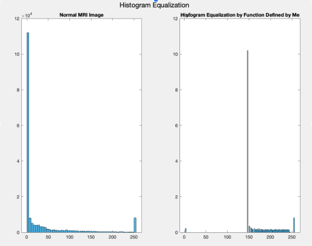
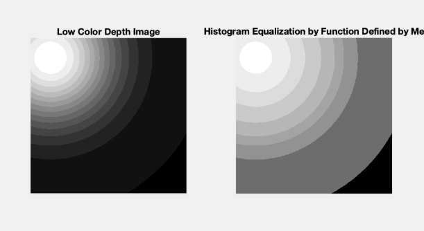
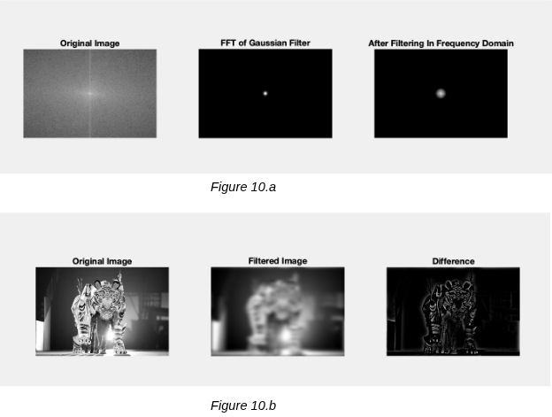

# 🖼️ Digital Image Processing – Advanced Projects (MATLAB)

This repository extends my **Digital Image Processing Fundamentals** portfolio with additional projects implemented in MATLAB.  
The work highlights the design, coding, and analysis of image transformations, quantization, edge detection, spatial filtering, histogram operations, and frequency-domain filtering.

> 🚀 Originally inspired by coursework, these projects are reframed and structured as **independent portfolio work** to demonstrate applied skills in computer vision, digital signal processing, and image analysis.

---

## 🔍 Project Highlights
- ✅ Generated synthetic images (stripes, ramps, Gaussian, and colored quadrants).  
- ✅ Implemented **image quantization** and analyzed false contouring effects.  
- ✅ Applied **Sobel filters, |Gx|+|Gy|, and gradient magnitude** edge detectors.  
- ✅ Performed **box filtering and unsharp masking** with varying sharpness factors.  
- ✅ Derived **equivalent one-pass filters** via Fourier analysis.  
- ✅ Explored **histogram-controlled images**, averaging effects, and histogram equalization.  
- ✅ Applied **high-boost and Gaussian frequency filters** to real images.  
- ✅ Investigated **sampling theory (Nyquist rate)** and **Fourier spectra with zero-padding**.

---

## 📂 Repository Structure
```text
├── README.md
├── src/                                       ← MATLAB scripts
├── images/                                    ← saved results and plots

```

---

## 📘 Detailed Analysis

### 1. Synthetic Image Generation (500×500, 8-bit)
Created various grayscale and color images using vectorized MATLAB operations:  
- Constant intensity image.  
- Vertical stripes (2-pixel width).  
- Half-intensity split (left vs right).  
- Ramp distribution (I(x,y)=0.5x).  
- Gaussian blob centered at (64,64).  
- Color quadrants (white, magenta, cyan, blue).  

This exercise demonstrated **image matrix construction and efficient coding without loops**.

**Code**:

```
clear; clc; close all;

%% Part a- Create the following 500 × 500 8-bit images in MATLAB: A grayscale image of constant intensity 60
image_a = uint8(ones(500,500)*60);
figure
imshow(image_a, [])

%% Part b- Create the following 500 × 500 8-bit images in MATLAB: A grayscale image with alternating black and white vertical stripes, each of which is 2
% pixels wide.
image_b = uint8(repmat([zeros(500,2) ones(500, 2)*255],[1 125]));
figure
imshow(image_b, [])

%% Part c- Create the following 500 × 500 8-bit images in MATLAB:  A grayscale image where the left half has intensity 32 and the right half has intensity 200.
image_c = uint8([32*ones(500,250) 200*ones(500,250)]);
figure
imshow(image_c, [])

%% Part d- Create the following 500 × 500 8-bit images in MATLAB: A grayscale image with a ramp intensity distribution, described by I(x, y) = 0.5x
[X,Y] = meshgrid(1:500,1:500);
image_d = uint8(0.5*Y);
figure
imshow(image_d, [])

%% Part e- Create the following 500 × 500 8-bit images in MATLAB: A grayscale image with a Gaussian intensity distribution centered at (64, 64), described by the function given
[X,Y] = meshgrid(1:500,1:500);
image_e = uint8(255 * exp(-1* ((X-64).^2 + (Y-64).^2)/ 200^2));
figure
imshow(image_e, [])

%% Part f- Create the following 500 × 500 8-bit images in MATLAB: A color image where the upper left quadrant is white, the lower left quadrant is magenta,
% the upper right quadrant is cyan, and the lower right quadrant is blue.
white = ones(250,250,3)*255;
magenta = cat(3, ones(250,250)*255, zeros(250,250), ones(250,250)*255);
cyan = cat(3, zeros(250,250),ones(250,250)*255,  ones(250,250)*255);
blue =  cat(3, zeros(250,250),zeros(250,250),  ones(250,250)*255);
image_f = [ white,cyan; magenta,blue];
figure
imshow(image_f, [])
```

**Results**:


---

### 2. Image Quantization & False Contouring
Quantized the Gaussian image (Problem 1e) into 256, 128, 64, 32, and 16 gray levels.  
- At **64 levels**, false contours become perceptible.  
- At **32 and 16 levels**, concentric banding is very clear.  

This experiment revealed **human sensitivity to gray-level reduction** and how coarse quantization introduces visible artifacts.

**Code**:
```
clear; clc; close all;

%% Part e- Create the following 500 × 500 8-bit images in MATLAB: A grayscale image with a Gaussian intensity distribution centered at (64, 64), described by the function given
[X,Y] = meshgrid(1:500,1:500);
image_e = uint8(255 * exp(-1* ((X-64).^2 + (Y-64).^2)/ 200^2));

quantize_values = {256,128,64,32,16}

%% Quantized Version of image with 128 gray levels
showQuantizedImages(image_e,quantize_values,"Q2_Resulting_Images","Quantized Image",3,2)


%% This function will display the images and their histograms
function showQuantizedImages(image, quantized_values, file_name, final_image_name, subplot_x,subplot_y)
%Display the Images 
    figure
    for i=1:length(quantized_values)
        % Perform Quantization 
        levels = linspace(0,255,quantized_values{i});
        currentImage = imquantize(image,levels);
        % Create a subplot
        subplot(subplot_x, subplot_y, i);
        % Display the image with its label
        imshow(currentImage, []);
        % Compute the noise standard deviation and mean before and after filtering. 
        title(final_image_name + quantized_values{i});
        imwrite(mat2gray(currentImage),fullfile(file_name, quantized_values{i}+".jpg"));
    end
    % Adjust layout
    sgtitle(final_image_name);
    set(gcf, 'Position', [100, 100, 800, 600]);
    saveas(gcf, fullfile(file_name, final_image_name+ ".jpg"));
end
```
I used the part e from question 1 to create the grayscale image with a Gaussian intensity distribution centered at (64, 64), described in the homework description. After that, I initialized the quantized values as 256, 128, 64,32 and 16. In this code I used one function defined by me and called showQuantizedImages. It is taking 6 inputs:  image as the image that will be shown, quantized values, file name to save the images in, final image name to save the images and subplot values for the plotting images to the figure. 


**Result**: 


 As shown in Figure , from my view, it becomes easy to visually detect the false contour starting from 64 gray scale values. When one zooms on it, it is easy to see the layered structure of the gray values compared to 128 and 256 gray values. It becomes clearer in the 32 and 16 gray scale images. In the 16 gray scale image, one can easily observe the layered circles. One can also analyze these images in the ‘Q2_Resulting_Images’ file that I submitted.


---

### 3. Edge Detection (Sobel, Sum, Magnitude)
Performed three edge-detection methods on `target.png`, `crystals.png`, and `lena.png`:  
- Horizontal & Vertical Sobel filters.  
- **|Gx|+|Gy|** operator.  
- **Gradient magnitude** (sqrt(Gx²+Gy²)).  

**Findings**:  
- Magnitude gradient gave the most complete edge maps.  
- |Gx|+|Gy| performed well but less precise.  
- Pure Sobel (X/Y) captured only directional edges.  

**Code**:
```
clear; clc; close all;
%% Read Images
 target_img = imread("target.png");
 crystals_img = imread("crystal.png");
 lena_img = imread("Lena.png");
 target_img = rgb2gray(target_img);
 crystals_img =rgb2gray(crystals_img);

 images = {target_img,crystals_img,lena_img};
 labels = {"Target Image", "Crystals Image", "Lena Image"};

%% Part a- Write a MATLAB program that performs and displays X and Y directed Sobel edge
% detection on three images.
% Create sobel filters
sobel_horizontal = [-1 -2 -1
               0 0  0
               1 2  1];
sobel_vertical = transpose(sobel_horizontal);
filtered_images = {};
filtered_labels = {};
for i=1:length(images)
    %Use imfilter
    filtered_images{length(filtered_images)+1} = images{i};
    filtered_labels {length(filtered_labels)+1} = labels{i};
    horizontal_gradient = imfilter(images{i},sobel_horizontal);
    vertical_gradient = imfilter(images{i},sobel_vertical);
    filtered_images{length(filtered_images)+1} = horizontal_gradient;
    filtered_labels {length(filtered_labels)+1} = labels{i} + " Horizontal Gradient";
    filtered_images{length(filtered_images)+1} = vertical_gradient;
    filtered_labels {length(filtered_labels)+1} = labels{i} + " Vertical Gradient";    
end
showImages(filtered_images,filtered_labels,"Q3_Resulting_Images/a","Sobel Edge Detections",3,3)

%% Part b- Write a MATLAB program that performs and displays |Gx| + |Gy| edge detection on three
% images.
abs_gradient_sum = {};
abs_gradient_sum_labels = {};
for i=1:length(images)
    horizontal_gradient_img = filtered_images{3*i-1};
    vertical_gradient_img = filtered_images{3*i};
    abs_sum_img = abs(horizontal_gradient_img+vertical_gradient_img);
    abs_gradient_sum{length(abs_gradient_sum)+1} = images{i};
    abs_gradient_sum{length(abs_gradient_sum)+1} = abs_sum_img;
    abs_gradient_sum_labels{length(abs_gradient_sum_labels)+1} = labels{i};
    abs_gradient_sum_labels{length(abs_gradient_sum_labels)+1} = labels{i} + " |Gx|+|Gy|";
end
showImages(abs_gradient_sum,abs_gradient_sum_labels,"Q3_Resulting_Images/b","Sum of Gradients",3,2)

%% Part c- Write a MATLAB program that performs and displays magnitude gradient edge detection
% on three images.
magnitude= {};
magnitude_labels = {};
for i=1:length(images)
    horizontal_gradient_img = filtered_images{3*i-1};
    vertical_gradient_img = filtered_images{3*i};
    magnitude_img = sqrt(double(horizontal_gradient_img.^2+vertical_gradient_img.^2));
    magnitude{length(magnitude)+1} = images{i};
    magnitude{length(magnitude)+1} = magnitude_img;
    magnitude_labels{length(magnitude_labels)+1} = labels{i};
    magnitude_labels{length(magnitude_labels)+1} = labels{i} + "-Magnitude";
end
showImages(magnitude,magnitude_labels,"Q3_Resulting_Images/c","Magnitude Gradient Edge Detection",3,2)


%% This function will display the images 
function showImages(images, labels, file_name, final_image_name, subplot_x,subplot_y)
%Display the Images 
    figure
    for i=1:length(images)
        currentImage = images{i};
        % Create a subplot
        subplot(subplot_x, subplot_y, i);
        % Display the image with its label
        imshow(currentImage, []);
        % Compute the noise standard deviation and mean before and after filtering. 
        title(labels{i});
        imwrite(mat2gray(currentImage),fullfile(file_name, labels{i}+".jpg"));
    end
    % Adjust layout
    sgtitle(final_image_name + "-Images");
    set(gcf, 'Position', [100, 100, 800, 600]);
    saveas(gcf, fullfile(file_name, final_image_name+ ".jpg"));
end


```
a-) For part a, I first created horizontal and vertical sobel filters and by using imfilter function filtered all of three images. The results can be seen in Figure 3.a.

b-) For part b  I took the absolute values of the X and Y directed sobel edge detected images and summed them. The results can be seen in Figure 3.b.

c-) For part c , I calculated the magnitude of gradient edge detections of three images.The results can be seen in Figure 3.c. For all three parts, I only used the extra function  showImages which is taking 6 different arguments to display the images in the intended way. It is taking the images and their labels as the input. Besides that, it is taking the file name for saving them in that file and the name of the image as the final_image_name. Besides that, subplot_x and subplot_y are the sizes of the plotting window to show multiple images in one window. In this function, images are displayed. 
Results: One can also analyze these images in the ‘Q3_Resulting_Images’ file that I submitted.

**Results**:


In my opinion, the best one that identifies the edges in images is the magnitude gradient edge detection performed in part c. Sum of gradients is also good but not better than magnitude gradient edge detection. I think the difference is more visible in crystal images. However, it is still better than the horizontal and vertical gradient edge detection. Because they only show the edges in horizontal and vertical directions, vertically. 


---

### 4. Box Filtering & Unsharp Masking
- Applied **5×5 averaging filter** → image blurred, fine details suppressed.  
- Implemented **unsharp masking (k=1…5)** → progressively sharpened details.  

**Observation**: Increasing *k* amplified acutance along edges. The trade-off: higher sharpness but risk of overshooting.

**Code**:
```
clear; clc; close all;
%% Read Images
fuzzy_cat = imread("fuzzycat.png");
%% Part a- Write a MATLAB program that performs a 5×5 averaging box filter on the image and
% displays the result. Include the result in the writeup. How does the image compare with
% the original? What details are different?
%Create Averaging Kernel
averaging_kernel_5 = createAveragingKernel(5);
    
%Apply averaging kernels
averaging_img_5 = imfilter(fuzzy_cat, averaging_kernel_5);
images_a = {fuzzy_cat,averaging_img_5};
labels_a = {"Original Image","Averaging Filter"};
showImages(images_a,labels_a,"Q4_Resulting_Images/a","Averaging Box Filtering 5x5",1,2)

%% Part b- Write a MATLAB program that implements equations 3-55 and 3-56 in G&W, with
% integer values of k ranging from 1 to 5 (inclusive) to apply unsharp masking, and displays
% all 6 images. Include all 6 images in the writeup. Explain what you see as k increases.
% How does the filtered image improve? Discuss specific regions in the image for full
% credit. Note that you should clip the results to [0, 255] before display.

%Equation 3-55- 𝑔mask(𝑥, 𝑦) = 𝑓(𝑥, 𝑦) − 𝑓'(𝑥, 𝑦) where 𝑓̅(𝑥, 𝑦) is the blurred image
gmask = fuzzy_cat - averaging_img_5;
%Equation 3-56- 𝑔(𝑥, 𝑦) = 𝑓(𝑥, 𝑦) + 𝑘𝑔mask(𝑥, 𝑦)
images_b ={};
labels_b={};
images_b{length(images_b)+1} = fuzzy_cat;
labels_b{length(labels_b)+1} = "Original Image";
for i=1:5
    gmask = fuzzy_cat - averaging_img_5;
    g = fuzzy_cat + i * gmask;
    images_b{length(images_b)+1} = min(max(g, 0), 255);;
    labels_b{length(labels_b)+1} = "Unsharp Masking with k="+i;
end
showImages(images_b,labels_b,"Q4_Resulting_Images/b","Unsharp Masking",2,3)


%% This function will take kernel size and create averaging kernel
function averaging_kernel = createAveragingKernel(kernel_size)
    averaging_kernel = ones(kernel_size,kernel_size) * (1/(kernel_size^2));
end

%% This function will display the images 
function showImages(images, labels, file_name, final_image_name, subplot_x,subplot_y)
%Display the Images 
    figure
    for i=1:length(images)
        currentImage = images{i};
        % Create a subplot
        subplot(subplot_x, subplot_y, i);
        % Display the image with its label
        imshow(currentImage, []);
        % Compute the noise standard deviation and mean before and after filtering. 
        title(labels{i});
        imwrite(mat2gray(currentImage),fullfile(file_name, labels{i}+".jpg"));
    end
    % Adjust layout
    sgtitle(final_image_name + "-Images");
    set(gcf, 'Position', [100, 100, 800, 600]);
    saveas(gcf, fullfile(file_name, final_image_name+ ".jpg"));
end
```
**Explanation of The Code:**
For this question I created two different functions in MATLAB. One of them, createAveragingKernel  is taking kernel size as the input and returning the averaging box kernel. The other one is showImages which is taking 6 different arguments to display the images in the intended way. It is taking the images and their labels as the input. Besides that, it is taking the file name for saving them in that file and the name of the image as the final_image_name. Besides that, subplot_x and subplot_y are the sizes of the plotting window to show multiple images in one window. In this function, images are displayed. 

For part a of question 4, I created the averaging kernel by the function I used. Then I filtered it by using the imfilter function.

For part b of question 4, I performed the unsharp masking by using the blurred image in part a. I also display the difference between the original image and the unsharpened version to see the difference better. 

**Results**:


Resulting image on the left is less detailed and blurred compared to the original (right) image.  To show the difference better, I also displayed the difference between the original image and the image after averaging the filter. In this way, we can see the lost details after averaging filtering. 


Unsharp masking increases the sharpness by increasing the acutance along the edges of the image. When the k value increases, the sharpness increases more since it strengthens the difference between the original image and blurred image. The difference between the original image and blurred image can be seen in Figure 4.a. Since we multiplied that difference by k and added it to the original image, if we increase the k value, we increase the effect of the difference and we sharpen the image. The effect of k can be seen in Figure 4.b. To see the effect of increasing k better, I also displayed the difference between the sharpened versions and the original image in Figure 4.c. 


---

### 5. Equivalent One-Pass Filter (Box + Laplacian)
Derived a single 2D filter by multiplying Fourier transforms of a **3×3 averaging filter** and a **3×3 Laplacian filter**.  
- Verified that **one-pass frequency filter ≈ two-pass spatial filtering**.  
- Results closely matched, though discretization introduced minor differences.  
- Confirmed that **filter order affects results**, especially in noisy images.

**Code**:
```
clear; clc; close all;
%% Read Images
% Read gaussian noise image
edges_gnoise = imread("Edges_gnoise.tif");
edges_gnoise = rgb2gray(edges_gnoise);
%% Part a- Suppose we filter an image twice: we first apply a 3×3 averaging box filter, and then filter the
% resulting image with the 3×3 Laplacian filter (the one with -4 in the
% middle element).  Determine (mathematically) a single 2D filter that will result in the same output using a
% single pass. Show your work.

% Multiple Pass in spatial domain directly
%Create Averaging Kernel
averaging_kernel_3 = createAveragingKernel(3);
    
%Apply averaging kernels
averaging_img_3 = imfilter(edges_gnoise, averaging_kernel_3);
laplacian_filter = [0 1 0
                    1 -4 1
                    0 1 0];
final_image_multipass = imfilter(averaging_img_3,laplacian_filter);

% One Pass trial by using Fourier Transformations
average_fft = fft2(averaging_kernel_3)
laplacian_fft = fft2(laplacian_filter)
one_pass_filter_fft = average_fft .* laplacian_fft
one_pass_filter_ifft = ifft(one_pass_filter_fft)


%Apply to image in spatial domain
final_image_onepass = imfilter(edges_gnoise,one_pass_filter_ifft);

images_a = {edges_gnoise,final_image_multipass,final_image_onepass};
labels_a = {"Original Image", "Multipass in spatial domain","One Pass in Frequency Domain"};
showImages(images_a,labels_a,"Q5_Resulting_Images/a","One Pass Filter Finding",1,3)

%% This function will take kernel size and create averaging kernel
function averaging_kernel = createAveragingKernel(kernel_size)
    averaging_kernel = ones(kernel_size,kernel_size) * (1/(kernel_size^2));
end

%% This function will display the images 
function showImages(images, labels, file_name, final_image_name, subplot_x,subplot_y)
%Display the Images 
    figure
    for i=1:length(images)
        currentImage = images{i};
        % Create a subplot
        subplot(subplot_x, subplot_y, i);
        % Display the image with its label
        imshow(currentImage, []);
        % Compute the noise standard deviation and mean before and after filtering. 
        title(labels{i});
        imwrite(mat2gray(currentImage),fullfile(file_name, labels{i}+".jpg"));
    end
    % Adjust layout
    sgtitle(final_image_name + "-Images");
    set(gcf, 'Position', [100, 100, 800, 600]);
    saveas(gcf, fullfile(file_name, final_image_name+ ".jpg"));
end
```

As I mentioned in the mathematical explanation, I performed Fourier Transformations to find the one pass filter. I used the showImages function as the same for the other questions in this homework. 


**Results**:


I chose the size of this kernel as 5x5 but one could also chose other dimensions. Here are the resulting images:

As one can observe from Figure, the images Multipass in spatial domain and One Pass in Frequency Domain are very similar to each other. They are not exactly the same since we tried to discretize the filter from Fourier Domain. However, as one can see we can find a kernel to do that.

The result would be different especially if the image has a noise. If we first applied the averaging box and then applied the Laplacian filter, since the averaging filter reduces the noise, the Laplacian filter could detect the edges successfully without strengthening the noise. However, if we first applied the Laplacian filter and then applied the averaging filter, and if the image has a noise, the Laplacian filter might strengthen the noises by detecting them and an averaging filter might not be very successful for every kind of noise to reduce significantly after they get strengthened. 


---

### 6. Histogram-Constrained Images
Created four distinct images with identical histograms (0, 128, 255 intensities with given probabilities).  
- After applying a **9×9 averaging filter**, their histograms diverged.  
- Explained by the fact that filtering depends on **spatial distribution of intensities**, not just counts.  

**Code**:
```
clear; clc; close all;
%%  Using MATLAB, MS Paint, or any other generative method of your choice, sketch 4 different
% images that all have the histogram given by: p(I(x,y) = 0) = 0.25,
% p(I(x,y) = 128) = 0.25, p(I(x,y) = 255) = 0.5
images_a = {};
labels_a = {};
% First Image
img_1 = [zeros(256,256) ones(256,256)*128; ones(256,512)*255];

% Second Image
% Randomize the image indices 
% Get the dimensions of the image
[rows, cols] = size(img_1);

% Reshape the image into a column vector
image_vector = reshape(img_1, [], 1);

% Generate random indices
random_indices = randperm(rows * cols);

% Rearrange the elements according to the random indices
randomized_image_vector = image_vector(random_indices);

% Reshape the randomized vector back into an image
img_2 = reshape(randomized_image_vector, [rows, cols]);

% Third Image
img_3 = uint8(repmat([ones(4,4)*255 zeros(4,4) ; ones(4, 4)*128 ones(4,4)*255],64));

%Fourth Image
img_4 = uint8(repmat([ones(32,32)*255 zeros(32,32) ; ones(32, 32)*128 ones(32,32)*255],8));

images_a ={img_1,img_2,img_3,img_4};
labels_a = {"Image 1", "Image 2", "Image 3","Image 4"};
showImages(images_a,labels_a,"Q6_Resulting_Images/a","Same Histogram Different Images",2,2)

%% Now, suppose each of these images was blurred using a 9×9 box averaging filter. Will the images
% have the same histogram after this operation? Why or why not?
averaging_kernel_9 = createAveragingKernel(9);
images_b={};
labels_b={};
for i =1:length(images_a)
    averaging_img = imfilter(images_a{i}, averaging_kernel_9);
    images_b{length(images_b)+1} = images_a{i};
    images_b{length(images_b)+1} = averaging_img;
    labels_b{length(labels_b)+1} = "Original Image "+ i;
    labels_b{length(labels_b)+1} = "Averaged Image "+ i;
end
showImages(images_b,labels_b,"Q6_Resulting_Images/b","After Averaging",4,2)

%% This function will take kernel size and create averaging kernel
function averaging_kernel = createAveragingKernel(kernel_size)
    averaging_kernel = ones(kernel_size,kernel_size) * (1/(kernel_size^2));
end

%% This function will display the images and their histograms
function showImages(images, labels, file_name, final_image_name, subplot_x,subplot_y)
%Display the Images 
    figure
    for i=1:length(images)
        currentImage = images{i};
        % Create a subplot
        subplot(subplot_x, subplot_y, i);
        % Display the image with its label
        imshow(currentImage, []);
        % Compute the noise standard deviation and mean before and after filtering. 
        title(labels{i});
        imwrite(mat2gray(currentImage),fullfile(file_name, labels{i}+".jpg"));
    end
    figure
    for i=1:length(images)
        currentImage = images{i};
        % Create a subplot
        subplot(subplot_x, subplot_y, i);
        % Create histogram for both images
        histogram(currentImage, 'Normalization','count');
        title(labels{i});
        imwrite(mat2gray(currentImage),fullfile(file_name, labels{i}+".jpg"));
    end
    % Adjust layout
    sgtitle(final_image_name);
    set(gcf, 'Position', [100, 100, 800, 600]);
    saveas(gcf, fullfile(file_name, final_image_name+ ".jpg"));
end
```

For this one, I created two different functions in MATLAB. One of them, createAveragingKernel  is taking kernel size as the input and returning the averaging box kernel. The other one is showImages which is taking 6 different arguments to display the images in the intended way. It is taking the images and their labels as the input. Besides that, it is taking the file name for saving them in that file and the name of the image as the final_image_name. Besides that, subplot_x and subplot_y are the sizes of the plotting window to show multiple images in one window. In this function, images and their histograms are displayed. 

I first created 4 different images with the given histogram values. After that, I created a 9x9 averaging kernel and filtered it with this kernel. Then I displayed their histograms to observe.

**Results**:

I first created 4 different images with the given histogram values. After that, I created a 9x9 averaging kernel and filtered it with this kernel. Then I displayed their histograms to observe.


Here are the histograms of these images:


This shows the images after filtered with a 9x9 averaging filter. If we look at their histograms after they are filtered as in Figure 6.d, we can easily observe that  their histograms are different. The reason for this is the averaging filter changes the intensity of pixels according to their neighbors and even though the total count of 3 different intensity values are the same for each image (histograms), their distribution among the images is different as one can observe. Therefore, after filtering by 9x9 averaging filter, their histograms are different. 


---

### 7. Custom Histogram Equalization
Implemented histogram equalization manually (per G&W Section 3.3.1).  
- Applied to **MRI spine scan** (`MRI.png`).  
- Enhanced visibility of faint spine details.  
- Compared with MATLAB’s `histeq` (different but related results).  

**Code**:
```
clear; clc; close all;
%% Read Images
 mri_img = imread("MRI.png");
corrected_img = uint8(histogram_equalization(mri_img, 256));
c2 = histeq(mri_img,256);

images = {mri_img,corrected_img,c2};
labels = {"Normal MRI Image", "Histogram Equalization by Function Defined by Me", "Histogram Equalization by Default MATLAB function"};

showImages(images,labels,"Q7_Resulting_Images","Histogram Equalization",1,3)

%% This function will display the images and their histograms
function showImages(images, labels, file_name, final_image_name, subplot_x,subplot_y)
%Display the Images 
    figure
    for i=1:length(images)
        currentImage = images{i};
        % Create a subplot
        subplot(subplot_x, subplot_y, i);
        % Display the image with its label
        imshow(currentImage, []);
        % Compute the noise standard deviation and mean before and after filtering. 
        title(labels{i});
        imwrite(mat2gray(currentImage),fullfile(file_name, labels{i}+".jpg"));
    end
    figure
    for i=1:length(images)
        currentImage = images{i};
        % Create a subplot
        subplot(subplot_x, subplot_y, i);
        % Create histogram for both images
        histogram(currentImage, 'Normalization','count');
        title(labels{i});
        imwrite(mat2gray(currentImage),fullfile(file_name, labels{i}+".jpg"));
    end
    % Adjust layout
    sgtitle(final_image_name);
    set(gcf, 'Position', [100, 100, 800, 600]);
    saveas(gcf, fullfile(file_name, final_image_name+ ".jpg"));
end
function corrected_img = histogram_equalization(image, L)
    % Create histogram for image
     [m,n] = size(image);
    % Create normalized Image Histogram
    hist = zeros(1,256);
    for row=1:m
        for col=1:n
            hist(image(row,col)+1) = hist(image(row,col)+1)+1;
        end
    end
    normalized_hist = hist / (m*n)
    lookup_transformation_table = zeros(256); 
    for k=1:256
        lookup_transformation_table(k) = (L-1) * sum(normalized_hist(1:k));
    end
    corrected_img = zeros(m,n);
    for row=1:m
        for col=1:n
            corrected_img(row,col) = lookup_transformation_table(image(row,col)+1);
        end
    end
end
```
Explanation of the code: For this question, I used two functions. One of them is showImages which is taking 6 different arguments to display the images in the intended way. It is taking the images and their labels as the input. Besides that, it is taking the file name for saving them in that file and the name of the image as the final_image_name. Besides that, subplot_x and subplot_y are the sizes of the plotting window to show multiple images in one window. In this function, images and their histograms are displayed. The essential histogram equalization function is handled in function histogram_equalization. It takes two arguments: image and L as the intensity level that will be used as the range. In this function, as defined in section 3.3.1 of G&W, first I created the histogram of the image by counting the intensity levels. After that,  I calculated the probability of the occurrence of the intensity level in the image by dividing the histogram counts to the total number of pixels (image area). After calculating the probabilities, I create a lookup table to keep track of which intensity values will be mapped to which intensity values. To fill that lookup table, I applied this transformation function. 

**Results**: 


As one can observe, after the histogram equalization, it is especially easy to see the left part of the spine. However, when I applied the MATLAB’s predefined histogram equalization function ‘histeq’, I got a different result than mine. The reason is that maybe that function used something additional. However, in my function I directly used the algorithm given in section 3.3.1 of G&W.




When we look at the histogram, even though after the equalization, it does not have the best shape for uniform distribution of the intensity levels, it is still better than the normal MRI image distribution. 

---

### 8. Equalization Analysis
- Equalization helped in medical images (e.g., highlighting spine fractures).  
- But in noisy or low-depth images (e.g., 16 levels), it amplified noise or caused information loss.  
- **Conclusion**: Equalization is powerful but context-dependent.

**Code**:
```
clear; clc; close all;
%% Read Images
tumor_img = imread("tumor_img.png");
tumor_img = rgb2gray(tumor_img);
corrected_img = uint8(histogram_equalization(tumor_img, 256));

images = {tumor_img,corrected_img};
labels = {"Normal Tumor Image", "Histogram Equalization by Function Defined by Me"};

showImages(images,labels,"Q8_Resulting_Images","Histogram Equalization",1,2)

%% Low Color depth 
[X,Y] = meshgrid(1:500,1:500);
image_e = uint8(255 * exp(-1* ((X-64).^2 + (Y-64).^2)/ 200^2));

levels = linspace(0,255,16);
currentImage = imquantize(image_e,levels);
corrected_img_depth = uint8(histogram_equalization(currentImage, 16));
images = {currentImage,corrected_img_depth};
labels = {"Low Color Depth Image", "Histogram Equalization by Function Defined by Me"};

showImages(images,labels,"Q8_Resulting_Images","Histogram Equalization -Low Depth",1,2)


%% Noisy Images
edges_gnoise = imread("Edges_gnoise.tif");
edges_gnoise = rgb2gray(edges_gnoise);
corrected_img_noise = uint8(histogram_equalization(edges_gnoise, 256));

images = {edges_gnoise,corrected_img_noise};
labels = {"Noisy Image", "Histogram Equalization by Function Defined by Me"};

showImages(images,labels,"Q8_Resulting_Images","Histogram Equalization -Noisy",1,2)


%% This function will display the images and their histograms
function showImages(images, labels, file_name, final_image_name, subplot_x,subplot_y)
%Display the Images 
    figure
    for i=1:length(images)
        currentImage = images{i};
        % Create a subplot
        subplot(subplot_x, subplot_y, i);
        % Display the image with its label
        imshow(currentImage, []);
        % Compute the noise standard deviation and mean before and after filtering. 
        title(labels{i});
        imwrite(mat2gray(currentImage),fullfile(file_name, labels{i}+".jpg"));
    end
    figure
    for i=1:length(images)
        currentImage = images{i};
        % Create a subplot
        subplot(subplot_x, subplot_y, i);
        % Create histogram for both images
        histogram(currentImage, 'Normalization','count');
        title(labels{i});
        imwrite(mat2gray(currentImage),fullfile(file_name, labels{i}+".jpg"));
    end
    % Adjust layout
    sgtitle(final_image_name);
    set(gcf, 'Position', [100, 100, 800, 600]);
    saveas(gcf, fullfile(file_name, final_image_name+ ".jpg"));
end
function corrected_img = histogram_equalization(image, L)
    % Create histogram for image
     [m,n] = size(image);
    % Create normalized Image Histogram
    hist = zeros(1,256);
    for row=1:m
        for col=1:n
            hist(image(row,col)+1) = hist(image(row,col)+1)+1;
        end
    end
    normalized_hist = hist ./ (m*n);
    lookup_transformation_table = zeros(1,256); 
    for k=1:256
        lookup_transformation_table(k) = round((L-1) * sum(normalized_hist(1:k)));
    end
    disp(lookup_transformation_table)
    corrected_img = zeros(m,n);
    for row=1:m
        for col=1:n
            corrected_img(row,col) = uint8(lookup_transformation_table(image(row,col)+1));
        end
    end
end
```

In problem 6, the images are filtered by a 9x9 averaging filter. Therefore, the  images in problem 6 are blurred since the averaging filter averages the intensity values of the neighbor pixels and changes the intensity values of the interest pixel. Their histogram was altered as in Figure 6.d depending on their neighbor pixels’ intensity values. Even though they have the same histogram before filtering, since the distribution and the location of these intensity levels are matters when filtering with a kernel, they had different histograms after the filtering process. For example, image 1 has similar histograms before and after filtering since the 3 different intensity levels are grouped at 3 different areas of the image. However, in image 2 (Figure 6.d), since the intensity values are randomly distributed, their histogram after filtering looks like a normal distribution. In problem 6, we altered the intensity values and histograms depending on how these intensity values are located in the image.

In problem 7, we directly altered images according to their histogram values. How these intensity values are distributed in the image did not affect our operation. We changed the intensity values in a way that we want the histogram values to be evenly distributed. 

I think the equalization process would be helpful in injury diagnosis cases. For example, in problem 7, in the original MRI image, it is hard to see the left part of the spine. Histogram equalization can be useful in diagnosis of injuries, tumors etc. For example, by using the same function in Problem 7, I tried to detect the whole tumor in the right image of Figure 8.a. As seen from the same figure, the tumor and its size/boundaries are more visible.  One can also analyze these images in the ‘Q8_Resulting_Images’ file that I submitted. 


Histogram equalization may not be useful in some cases. For example, in noisy images, it may not be useful to use histogram equalization directly since it may amplify the noise. For example, I tried a noisy image and the resulting image in the following Figure shows that it amplified the noise and produced an undesired effect.


In some of the medical images such as MRI and PET, there are noises such as Rician and Poisson. In these kinds of images, reducing the noise before histogram equalization may be more appropriate. Besides that, histogram equalization may not be good at low color depth images [4]. To try this, I created a 16 quantized image (as in Question 2) and performed the histogram equalization. 




In Figure 8.c, it is easy to see that the histogram equalization causes large loss of information. Even though most of the original image consists of black, after equalization, it is reduced. If that part image has significance, it would be inconvenient to apply histogram equalization. We can also say that for applications which have give importance to brightness preservation, it is inconvenient to use histogram equalization.


---

### 9. High-Boost Filtering
- Constructed a **high-boost filter** in spatial domain.  
- Verified frequency response via **2D FFT magnitude**.  
- Applied to `tiger.png` → sharpened high-frequency edges, left smooth regions mostly untouched.

**Code**:
```
clear; clc; close all;
%% Read Images
high_boost_filter = (1/16)* [-1 -2 -1; -2 28 -2; -1 -2 -1];

%% Part a- Write a MATLAB script that displays the magnitude of the 2D 256×256 DFT of this
% filter, centering so the DC term is at the center of the image. Include the resulting plot in
% the writeup. Interpret what you see.
% Compute the 2D DFT of the filter
fft_filter = fftshift(fft2(high_boost_filter, 256, 256));
images_a ={fft_filter};
labels_a = {"FFT of High Boost Filter"}
showFFT(images_a,labels_a, "Q9_Resulting_Images/a", "FFT of Filter", 1,1)

%% Part b- Write a MATLAB script that applies the filter to the image tiger.png and displays the
% result. Include the resulting image in your writeup. Does this agree with your
% interpretation of the DFT?
% Read Image
img = imread("tiger.png");
% Get image size
[m,n] = size(img);
%Create HighBoost Filter According to that size
fft_filter_2 = fftshift(fft2(high_boost_filter, m, n));
% Compute the Fourier Transform of the image
F = fftshift(fft2(double(img)));
G = F .* fft_filter_2;
% Compute the inverse Fourier Transform to obtain the filtered image
filtered_img = real(ifft2(ifftshift(G)));

%Show Images in Fourier Domain
images_b ={F,fft_filter_2,G};
labels_b = {"FFT of Tiger Image (centered)","FFT of High Boost Filter (centered)", "Resulting Filtered Image in Fourier Domain"}
showFFT(images_b,labels_b, "Q9_Resulting_Images/b", "Filtered Image in frequency Domain", 1,3)

%Show Images in Spatial Domain
images_b_2 ={img,filtered_img};
labels_b_2 = {"Original Image","Filtered Image"}
showImages(images_b_2,labels_b_2, "Q9_Resulting_Images/b", "Filtered Image in spatial Domain", 1,2)


%% This function will display the images 
function showImages(images, labels, file_name, final_image_name, subplot_x,subplot_y)
%Display the Images 
    figure
    for i=1:length(images)
        currentImage = images{i};
        % Create a subplot
        subplot(subplot_x, subplot_y, i);
        % Display the image with its label
        imshow(currentImage, []);
        % Compute the noise standard deviation and mean before and after filtering. 
        title(labels{i});
        try
            disp("here")
            imwrite(mat2gray(currentImage),fullfile(file_name, labels{i}+".jpg"));
        catch
             imwrite(mat2gray(abs(currentImage)),fullfile(file_name, labels{i}+"-magnitude.png"));
             imwrite(mat2gray(angle(currentImage)),fullfile(file_name, labels{i}+"-phase.png"));
        end
    end
    % Adjust layout
    sgtitle(final_image_name);
    set(gcf, 'Position', [100, 100, 800, 600]);
    saveas(gcf, fullfile(file_name, final_image_name+ ".jpg"));
end

%% This function will display the images 
function showFFT(images, labels, file_name, final_image_name, subplot_x,subplot_y)
%Display the Images 
    figure
    for i=1:length(images)
        currentImage = images{i};
        % Create a subplot
        subplot(subplot_x, subplot_y, i);
        % Display the image with its label
        imshow(log(1+abs(currentImage)), []);
        % Compute the noise standard deviation and mean before and after filtering. 
        title(labels{i});
        try
            imwrite(mat2gray(log(1+abs(currentImage))),fullfile(file_name, labels{i}+".jpg"));
        catch
             imwrite(mat2gray(log(1+abs(currentImage))),fullfile(file_name, labels{i}+"-magnitude.png"));
             imwrite(mat2gray(angle(currentImage)),fullfile(file_name, labels{i}+"-phase.png"));
        end
    end
    % Adjust layout
    sgtitle(final_image_name);
    set(gcf, 'Position', [100, 100, 800, 600]);
    saveas(gcf, fullfile(file_name, final_image_name+ ".jpg"));
end
```
Explanation of the code: showImages, showFFT are written to show images or the images in the Frequency domain respectively and save these images to the folder “Q9_Resulting_Images” folder that I submitted. One can observe the images from there. 

**Results**:


Figure shows the high boost filter’s shifted magnitude in Fourier domain. Normally when we display any image/filter without shifting, the center of the image corresponds to High frequency areas. However, shifting it to center leads to moving high frequency areas to corners and moving low frequency areas to the center as seen in the next Figure. Therefore, this Figure is blacked out in the low frequency area (at the middle)  and has higher intensity values around the corners of  Figure which corresponds to the high frequency area. Therefore, this filter is a high-boost-filter as mentioned.


Latest two Figures; Figure 9.c shows the filtering the image in the frequency domain. However, it is hard to observe the difference from that figure. Therefore by taking the inverse fourier transform of the image, we can observe the difference in spatial domain. When we take the difference of filtered image and original image in spatial domain, we can easily observe that the filtered image boosts the details of the image in Figure 9.d. We can see that it did not change the flat or smooth areas that have low frequency while it strengthens the  edges, high frequency areas.


---

### 10. Gaussian Frequency Filters
Tested Gaussian filters with different covariance matrices:  
- **[100 0;0 100]** → strong low-pass, heavy blur.  
- **[900 0;0 900]** → milder blur, retains more detail.  
- **[900 0;0 100]** → anisotropic, directional smoothing (vertical emphasis).  

Demonstrated how **filter covariance shapes frequency selectivity**.

**Code**:
```
clear; clc; close all;
%% Read Tiger Image
tiger_img = imread("tiger.png");
% Compute the Fourier Transform of the image
F = fftshift(fft2(double(tiger_img)));

%% Part a - Create Gaussian Filter C_a = [100 0; 0 100] 
C_a = [100 0; 0 100] ;
filt = fftshift(guassflt(tiger_img, C_a));
G_a = F .* filt;
images_a ={F,filt,G_a};
labels_a = {"Original Image","FFT of Gaussian Filter","After Filtering In Frequency Domain"}
showFFT(images_a,labels_a, "Q10_Resulting_Images/a", "FFT of Filter", 1,3)
% Compute the inverse Fourier Transform to obtain the filtered image
filtered_img_a = real(ifft2(ifftshift(G_a)));
%Show Images in Spatial Domain
images_a_2 ={tiger_img,filtered_img_a,uint8(filtered_img_a)-tiger_img};
labels_a_2 = {"Original Image","Filtered Image","Difference"}
showImages(images_a_2,labels_a_2, "Q10_Resulting_Images/a", "Filtered Image in spatial Domain", 1,3)


%% Part b - Create Gaussian Filter C_b = [900 0; 0 900] 
C_b = [900 0; 0 900] ;
filt_b = fftshift(guassflt(tiger_img, C_b));
G_b = F .* filt_b;
images_b ={F,filt_b,G_b};
labels_b = {"Original Image","FFT of Gaussian Filter","After Filtering In Frequency Domain"}
showFFT(images_b,labels_b, "Q10_Resulting_Images/b", "FFT of Filter", 1,3)
% Compute the inverse Fourier Transform to obtain the filtered image
filtered_img_b = real(ifft2(ifftshift(G_b)));
%Show Images in Spatial Domain
images_b_2 ={tiger_img,filtered_img_b,uint8(filtered_img_b)-tiger_img};
labels_b_2 = {"Original Image","Filtered Image","Difference"}
showImages(images_b_2,labels_b_2, "Q10_Resulting_Images/b", "Filtered Image in spatial Domain", 1,3)

%% Part c - Create Gaussian Filter C_c = [900 0; 0 100] 
C_c = [900 0; 0 100] ;
filt_c = fftshift(guassflt(tiger_img, C_c));
G_c = F .* filt_c;
images_c ={F,filt_c,G_c};
labels_c = {"Original Image","FFT of Gaussian Filter","After Filtering In Frequency Domain"}
showFFT(images_c,labels_c, "Q10_Resulting_Images/c", "FFT of Filter", 1,3)
% Compute the inverse Fourier Transform to obtain the filtered image
filtered_img_c = real(ifft2(ifftshift(G_c)));
%Show Images in Spatial Domain
images_c_2 ={tiger_img,filtered_img_c,uint8(filtered_img_c)-tiger_img};
labels_c_2 = {"Original Image","Filtered Image","Difference"}
showImages(images_c_2,labels_c_2, "Q10_Resulting_Images/c", "Filtered Image in spatial Domain", 1,3)


%% This function will display the images 
function showImages(images, labels, file_name, final_image_name, subplot_x,subplot_y)
%Display the Images 
    figure
    for i=1:length(images)
        currentImage = images{i};
        % Create a subplot
        subplot(subplot_x, subplot_y, i);
        % Display the image with its label
        imshow(currentImage, []);
        % Compute the noise standard deviation and mean before and after filtering. 
        title(labels{i});
        try
            disp("here")
            imwrite(mat2gray(currentImage),fullfile(file_name, labels{i}+".jpg"));
        catch
             imwrite(mat2gray(abs(currentImage)),fullfile(file_name, labels{i}+"-magnitude.png"));
             imwrite(mat2gray(angle(currentImage)),fullfile(file_name, labels{i}+"-phase.png"));
        end
    end
    % Adjust layout
    sgtitle(final_image_name);
    set(gcf, 'Position', [100, 100, 800, 600]);
    saveas(gcf, fullfile(file_name, final_image_name+ ".jpg"));
end

%% This function will display the images 
function showFFT(images, labels, file_name, final_image_name, subplot_x,subplot_y)
%Display the Images 
    figure
    for i=1:length(images)
        currentImage = images{i};
        % Create a subplot
        subplot(subplot_x, subplot_y, i);
        % Display the image with its label
        imshow(log(1+abs(currentImage)), []);
        % Compute the noise standard deviation and mean before and after filtering. 
        title(labels{i});
        try
            imwrite(mat2gray(log(1+abs(currentImage))),fullfile(file_name, labels{i}+".jpg"));
        catch
             imwrite(mat2gray(log(1+abs(currentImage))),fullfile(file_name, labels{i}+"-magnitude.png"));
             imwrite(mat2gray(angle(currentImage)),fullfile(file_name, labels{i}+"-phase.png"));
        end
    end
    % Adjust layout
    sgtitle(final_image_name);
    set(gcf, 'Position', [100, 100, 800, 600]);
    saveas(gcf, fullfile(file_name, final_image_name+ ".jpg"));
end
% gaussfilt function takes as input a grayscale image 
% im and a 2x2 covariance matrix C.
% The filter returns a low-pass frequency-domain Gaussian filter 
% the same size as im centered at DC with the given covariance matrix.

function imfilt = guassflt(im, filt)
[a,b] = size(im);
[x,y] = meshgrid(1:b,1:a);
imfilt = exp(-0.5*sum([x(:)-(b+1)/2 y(:)-(a+1)/2].^2 *inv(filt),2));
imfilt = reshape(imfilt, [a b]);
maxi = max(imfilt(:));
imfilt = fftshift(imfilt/maxi);
end
```

**Results**:



As seen in Figure 10.a, the filter is a low-pass filter. It will only pass low frequencies and blur the image as seen in Figure 10.b.  The covariance matrix 𝐶 = [100 0; 0 100] is referred as a spherical Gaussian since the  probability distribution has spherical (circular) symmetry. The covariance matrix is diagonal and diagonal elements have value 100. Since it considers the multidimensional case, the normalization term in front of the exponential is the determinant of the covariance matrix and it can be regarded as a measure of its size [5]. Thisfilter is a low pass filter, therefore it will only pass the low frequencies of the images while attenuating the high frequencies. Therefore, it will blur the images. One can also see the difference between the images as the fine details. We can see that in the frequency domain the higher frequencies are blacked out while lower frequencies have remained the same. 


As seen in Figure 10.c, the filter is a low-pass filter. It will only pass low frequencies and blur the image as seen in Figure 10.d.  The covariance matrix 𝐶 = [900 0; 0 900] is referred as a spherical Gaussian since the  probability distribution has spherical (circular) symmetry. The covariance matrix is diagonal and diagonal elements have value 900 this time. Since it considers the multidimensional case, the normalization term in front of the exponential is the determinant of the covariance matrix and it can be regarded as a measure of its size [5]. This time the size of the circular area in the filter is high as one can compare with Figure 10.a. This means that it will pass high frequencies more than the filter in Figure 10.a  and blurr the image less compared to it. 

Again, this filter is a low pass filter, therefore it will only pass the low frequencies of the images while attenuating the high frequencies. Therefore, it will blur the images. One can also see the difference between the images as the fine details. We can see that in the frequency domain the higher frequencies are blacked out while lower frequencies have remained the same. 


As seen in Figure 10.e, the filter is a low-pass filter. It will only pass low frequencies and blur the image as seen in Figure 10.f.  The covariance matrix  is 𝐶 = [900 0; 0 100].  In this case the covariance matrix is again diagonal, but the variances are not equal. Thus the resulting
pdf has an elliptical shape [5]. This time we can observe that the blurring is in between part a and part b. However, I realized that the smoothing varies depending on the direction in this situation. It seems like it performed the smoothing vertically. When we look at the differences, we can also observe this.


---

### 11. Sampling & Nyquist Rate
Analyzed composite function:  
$$
f(t) = A \sin(\pi t) + B \sin(4\pi t) + C \cos(8\pi t)
$$
- Highest frequency = 0.5 Hz.  
- Nyquist rate = **1 Hz**.  
- Must sample ≥ 1 Hz for perfect recovery.


---

### 12. Zero-Padding & Fourier Spectra
Showed how **zero-padding introduces artificial high frequencies** at image edges.  
- Padded images → sharp boundaries → vertical & horizontal spectral spikes.  
- Demonstrated visually with FFT comparison.

**Code**:
```
clear; clc; close all;
%% Read Tiger Image
tiger_img = imread("zero_pad.png");
tiger_img = rgb2gray(tiger_img);
% Compute the Fourier Transform of the image
F = fftshift(fft2(double(tiger_img)));
padded_img  =  padarray(tiger_img,[10 10],0,'both')
padded_F = fftshift(fft2(double(padded_img)));
images_a ={F,padded_F};
labels_a = {"Original Image", "Padded Image"}
showFFT(images_a,labels_a, "Q12_Resulting_Images", "FFT of Filter", 1,2)
%% This function will display the images 
function showFFT(images, labels, file_name, final_image_name, subplot_x,subplot_y)
%Display the Images 
    figure
    for i=1:length(images)
        currentImage = images{i};
        % Create a subplot
        subplot(subplot_x, subplot_y, i);
        % Display the image with its label
        imshow(log(1+abs(currentImage)), []);
        % Compute the noise standard deviation and mean before and after filtering. 
        title(labels{i});
        try
            imwrite(mat2gray(log(1+abs(currentImage))),fullfile(file_name, labels{i}+".jpg"));
        catch
             imwrite(mat2gray(log(1+abs(currentImage))),fullfile(file_name, labels{i}+"-magnitude.png"));
             imwrite(mat2gray(angle(currentImage)),fullfile(file_name, labels{i}+"-phase.png"));
        end
    end
    % Adjust layout
    sgtitle(final_image_name);
    set(gcf, 'Position', [100, 100, 800, 600]);
    saveas(gcf, fullfile(file_name, final_image_name+ ".jpg"));
end
```
**Results**:
If we pad the image with zeros, this will cause a sharp transition between the zero padding part and the boundaries of the image. This sharp transition means a high frequency component. Therefore, padding images with zeros will create horizontal and vertical high frequency components along the axes of the spectrum. I also tried one example myself by padding this image: 


As one can see, after I padded the images with zeros, since they cause sharp transitions along the vertical and horizontal boundaries of the image, the vertical and horizontal axes of the spectrum strengthened. One can see the resulting images in the ‘Q12_Resulting_Images’ folder that I submitted.


---

## 🎓 Learning Outcomes
- Implemented **spatial and frequency-domain filters**.  
- Explored **quantization, contouring, and histogram shaping**.  
- Practiced **MATLAB-based image analysis with reusable helper functions**.  
- Gained intuition on **filter order, frequency response, and sampling theory**.

---

## 🛠️ Tools
- MATLAB (R2023a)  
- Image Processing Toolbox  

---

## 📜 References
- Gonzalez & Woods, *Digital Image Processing* (4th Edition).  
- MathWorks Documentation (repmat, meshgrid, cat, imfilter, fft2).  
- [Edinburgh Lecture Notes on Gaussians](https://www.inf.ed.ac.uk/teaching/courses/inf2b/learnnotes/inf2b-learn-note08-2up.pdf).  
- GIS Wiki: [Histogram Equalization](https://wiki.gis.com/wiki/index.php/Histogram_equalization).  

---

## 👩‍💻 Author
**Ilke Kas**  
Graduate Researcher – Robotics & Computer Vision  
[LinkedIn](https://www.linkedin.com/) | [GitHub](https://github.com/ilkekas)
