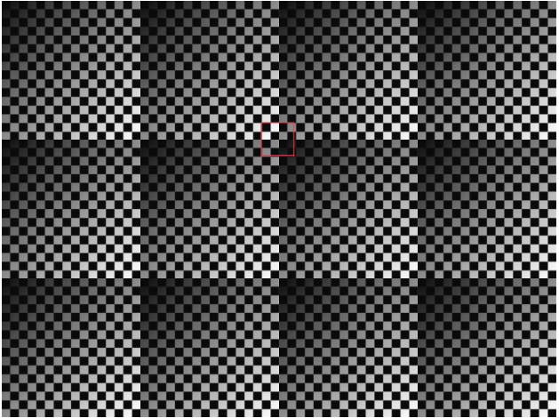

# 📸 Digital Image Processing Fundamentals (MATLAB Projects)

This repository presents a collection of **applied image processing experiments** implemented in MATLAB.  
Each problem explores a fundamental concept in **Digital Image Processing (DIP)** with **mathematical reasoning, code implementations, and visual results**.  

> 🚀 Although originally inspired by coursework, the content here is fully reframed and documented as independent portfolio projects to demonstrate skills in computer vision, image filtering, and transformation techniques.

---

## 🔍 Project Highlights
- ✅ Designed a **low-cost color classification system** using optical filters and monochrome imaging.  
- ✅ Explored **adjacency and shortest path finding** in digital images using 4-, 8-, and m-adjacency.  
- ✅ Implemented **geometric transformation matrices** (scaling, translation, rotation, shear).  
- ✅ Demonstrated **contrast stretching and histogram equalization** for intensity enhancement.  
- ✅ Experimented with **Gaussian convolution kernels** and their properties.  
- ✅ Compared **smoothing vs Laplacian filtering order** and explained why results differ.  
- ✅ Derived a **3×3 unsharp masking kernel** via Fourier analysis.  

---

## 📂 Repository Structure
```text
├── README.md                                ← this file
├── src/                                      ← MATLAB scripts for each problem
├── images/                                   ← saved figures and visual outputs
└── results/                                  ← processed outputs (histograms, filtered images, etc.)
```

---

## 📘 Detailed Analysis

### 1. 🚗 Car Color Detection via Filters
**Problem** : An automobile manufacturer is automating the placement of decorative inlays on the bumpers of a limited-edition line of sports cars. The decorations are color-coordinated, so the assembly robots need to know the color of each car in order to select the appropriate bumper component.
Models come in only four colors: blue, green, red, and white. You are hired to propose a solution based on imaging (space does not permit the construction of four different assembly lines, and synchronizing the cars leaving the spray-paint area would slow down the whole process). How would you solve the problem of determining the color of each car, keeping in mind that cost is the most important consideration in your choice of components?

**Goal**: Automate car color recognition (blue, green, red, white) for industrial assembly lines.  

**Approach**:  
- Used **two color filters** (red + green) placed over halves of a monochrome camera lens.  
- Analyzed **intensity differences** between filtered regions.  

**Findings**:
- **Green car** → high intensity under green filter, dark under red filter.  
- **Red car** → high intensity under red filter, dark under green filter.  
- **Blue car** → dark under both filters (distinguished from white).  
- **White car** → bright under both filters (only case with dual high response).  

This method is **cost-efficient**, requiring only a grayscale camera + filters, and robust enough for practical deployment.  

---

### 2. 🔗 Shortest Paths in Binary Images


**Task**: Compute shortest paths between two points under adjacency constraints (V={0,1}).  

- **4-path** → no valid path exists.  
- **8-path** → shortest path exists, length = 4.  
- **m-path** → valid path exists, length = 5.  

This demonstrates how **adjacency definitions affect connectivity** in digital images.  

---

### 3. 🔄 Composite Geometric Transformations
Built **single transformation matrices** for combinations of:  
- Scaling + Translation  
- Scaling + Translation + Rotation  
- Shearing + Scaling + Translation + Rotation  

**Key Insight**: The **order of operations matters**. Scaling before translation ≠ translation before scaling. Results confirm that transformation matrices are **non-commutative**.  

---

### 4. 🌈 Contrast Stretching
Let's give a single intensity transformation function for spreading the intensities of an image so the lowest intensity is 0 and the highest is L − 1. 

**Formula**:  
$$
f_{new}(x,y) = \frac{f(x,y) - f_{min}}{f_{max} - f_{min}} \cdot (L-1)
$$

- When **L = 255**, intensities stretched across full 0–254 range.  
- When **L = 90**, intensities compressed into [0, 89].  

This experiment highlights how **contrast stretching improves dynamic range visibility**. The following the code segment that I perform the spreading the intensities of an image so the lowest intensity is 0 and the highest is L − 1. I give 255 to the L value. These are the results:

**Code**:

```
clear; clc; close all;

% Read the image
img = imread('intensity_spread.png');

% Convert the image to grayscale if it's not already grayscale
if size(img, 3) == 3
    img = rgb2gray(img);
end

% Display the original image and its histogram
figure
subplot(1,3,1)
imshow(img)
title('Original Image')
subplot(1,3,2:3)
imhist(img)
title('Histogram')

% Apply intensity stretching
L = 90;
min_intensity = min(img(:));
max_intensity = max(img(:));

img_stretched =  (img - min_intensity) * ((L-1) / (max_intensity - min_intensity));


% Display the stretched image and its histogram
figure
subplot(1,3,1)
imshow(uint8(img_stretched)) % Convert back to uint8 for imshow
title('Stretched Image')
subplot(1,3,2:3)
imhist(uint8(img_stretched)) % Convert back to uint8 for imhist
title('Stretched Histogram')

```
**Results**:


As you can see from Figure, the intensity values of the images are stretched to values between 0 to L-1 (254 for this example). This is called contrast stretching. 


When I give L=90, As you can see from Figure 6, the intensity values of the images are stretched to values between 0 to 89.

---

### 5. 📊 Histogram Equalization (Double Pass)
**Experiment**: Applied histogram equalization twice.  

**Code**:
```
clear; clc; close all;
% Read the image
img = imread('histogram_equalization.png');
%Convert the image to the grayscale
if size(img, 3) == 3
    img = rgb2gray(img);
end

% Adjust the contrast using histogram equalization.
% Use the default behavior of the histogram equalization function, histeq.
% The default target histogram is a flat histogram with 64 bins.
equalized_img = histeq(img);

% Second pass on the histogram-equalized image
second_pass_equalized_img = histeq(equalized_img);

images = {img,equalized_img,second_pass_equalized_img};
labels = {"Original Image", "Image After Histogram Equalization", "Second Pass on the Histogram Equalized Image"};

showImages(images, labels, "Q5_Resulting_Images", "Histogram Equalization", 1,3)

% Compare the second pass and first pass after histogram equalization
is_same_img = (equalized_img == second_pass_equalized_img);
if is_same_img
    disp(" second pass of histogram equalization (on the histogram-equalized image) ..." + ...
        " will produce exactly the same image as the first pass ")
else
    disp(" second pass of histogram equalization (on the histogram-equalized image) ..." + ...
        " will not produce exactly the same image as the first pass ")
end

%% This function will display the images and their histograms
function showImages(images, labels, file_name, final_image_name, subplot_x,subplot_y)
%Display the Images 
    figure
    for i=1:length(images)
        currentImage = images{i};
        % Create a subplot
        subplot(subplot_x, subplot_y, i);
        % Display the image with its label
        imshow(currentImage, []);
        % Compute the noise standard deviation and mean before and after filtering. 
        title(labels{i} + " mean:" + mean2(currentImage) + " std: " + std2(currentImage));
        imwrite(mat2gray(currentImage),fullfile(file_name, labels{i}+".jpg"));
    end
    % Adjust layout
    sgtitle(final_image_name + "-Images");
    set(gcf, 'Position', [100, 100, 800, 600]);
    saveas(gcf, fullfile(file_name, final_image_name+ ".jpg"));
    figure
    for i=1:length(images)
        currentImage = images{i};
        % Create a subplot
        subplot(subplot_x, subplot_y, i);
        % Create histogram for both images
        histogram(currentImage, 'Normalization','count');
        title(labels{i});
        imwrite(mat2gray(currentImage),fullfile(file_name, labels{i}+".jpg"));
    end
    % Adjust layout
    sgtitle(final_image_name+"-Histograms");
    set(gcf, 'Position', [100, 100, 800, 600]);
    saveas(gcf, fullfile(file_name, final_image_name+ ".jpg"));
end

```

**Result**:  


As one can see from Figures, the second pass of the histogram equalization is the same with the first pass of the histogram equalization. They seem exactly the same and their histograms seem to be the same. To be sure about this, I also compared these two image arrays in matlab and check whether they are the same or not in this code snippet:


- The **second pass produced the exact same image** as the first.  
- Confirmed both visually (identical histograms) and computationally (MATLAB array comparison).  

This illustrates the **idempotent property** of histogram equalization.  


---

### 6. 🔍 Convolution & Bias Check
**Kernel vs Image convolution**: Implemented MATLAB convolution with given kernel.  

**Code**:

```
clear; clc; close all;
% Create kernel and the image
f = ones(5,5);
w = [1 2 1
    2 4 2
    1 2 1];
%Convolve these two
conv_result = conv2(f,w)
%Check bias
sum_f = sum(f(:))
sum_conv_result = sum(w(:))

if sum_f == sum_conv_result
    disp(['the sum of the pixels in the original and filtered images were the same,' ...
        ' thus preventing a bias from being introduced by filtering'])
else
    disp(['the sum of the pixels in the original and filtered images were not the same' ...
        ', thus have a bias from being introduced by filtering'])
end

```

**Result**:  


- Output sum ≠ input sum → indicates a **bias introduced by filtering**.  
- Demonstrates that filtering can alter image brightness distribution if not normalized.  

---

### 7. 🌐 Gaussian Kernel Combination
**Experiment**: Applied 3×3 Gaussian kernel (σ=1) four times.  

- Resulting **single equivalent kernel** → size 9×9.  
- Effective **σ = 2** (proved by convolution property of Gaussians).  

This shows how repeated smoothing can be **modeled as a larger kernel with higher variance**.  

**Code**:

```
clear; clc; close all;
% Create gaussian kernel
h = fspecial('gaussian', [3 3],1)

h1 = conv2(h,h)
h2 = conv2(h, h1)
h3 = conv2(h,h2)

%standard deviation part
```

---

### 8. 🟦 Low-Pass Filtering & Corner Artifacts
**Observation**: Extracted shading pattern corners appear darker/lighter.  

**Code**:

```
clear; clc; close all;
% Read the image
img = imread('shading.png');
%Convert the image to the grayscale
if size(img, 3) == 3
    img = rgb2gray(img);
end
img = imresize(img, [2048 2048])

% Number of times to tile the image
num_rows = 3; % Number of times to tile along rows
num_cols = 4; % Number of times to tile along columns

% Tile the image
tiled_img = repmat(img, [num_rows, num_cols]);

% Create large gaussian kernel
h = fspecial('gaussian', [512 512],128);

%Filter image
filtered_img = conv2(tiled_img, h, 'valid' );

images = {tiled_img,filtered_img, filtered_img(1:632,1:636)};
labels = {"Original Image", "Filtered image", 'One Image'};

showImages(images, labels, "Q8_Resulting_Images", "Shading Pattern", 1,3)


%% This function will display the images and their histograms
function showImages(images, labels, file_name, final_image_name, subplot_x,subplot_y)
%Display the Images 
    figure
    for i=1:length(images)
        currentImage = images{i};
        % Create a subplot
        subplot(subplot_x, subplot_y, i);
        % Display the image with its label
        imshow(currentImage, []);
        % Compute the noise standard deviation and mean before and after filtering. 
        title(labels{i} + " mean:" + mean2(currentImage) + " std: " + std2(currentImage));
        imwrite(mat2gray(currentImage),fullfile(file_name, labels{i}+".jpg"));
    end
    % Adjust layout
    sgtitle(final_image_name + "-Images");
    set(gcf, 'Position', [100, 100, 800, 600]);
    saveas(gcf, fullfile(file_name, final_image_name+ ".jpg"));
end
```

**Result**:



**Reason**:  
The corners of the extracted shading pattern appear darker or lighter than their surrounding area due to 2 reasons. Firstly, the image is shaded by a shading pattern oriented in the-45 direction.When the low pass filtering is performed, instead of zero-padding if one uses tiled padding as in the following image, the corners of the extracted shading pattern appear darker or lighter than their surrounding areas because the corners have different brightness levels as seen from the image. If we focus on the red box part, we can understand why the corners of the extracted shading pattern appear darker or lighter than their surrounding areas better.

- Shading oriented at -45°.  
- Tiled padding introduces **boundary inconsistencies** → visible corner artifacts.  

Highlights the importance of **padding strategy** in convolution.  

---

### 9. ⚖️ Smoothing vs Laplacian (Order Matters)
- **Smoothing → Laplacian**: Noise reduced first, then edges enhanced → clean results.  
- **Laplacian → Smoothing**: Noise amplified first, harder to filter later.  

Difference maps confirmed results are **not equivalent**. This emphasizes **pre-processing order in image enhancement pipelines**.  

**Code**:

```
clear; clc; close all;
%Read gaussian noise image
edges_gnoise = imread("noisy.png");
%Convert the image to the grayscale
if size(edges_gnoise, 3) == 3
    edges_gnoise = rgb2gray(edges_gnoise);
end
% Create large gaussian kernel
h_noise = fspecial('gaussian', [21 21],3.5);
h_laplacian = fspecial('laplacian', 0);

%Filter image
filtered_img_noise_1 = conv2(edges_gnoise, h_noise);
filtered_img_laplacian_1 = conv2(filtered_img_noise_1, h_laplacian );

%Filter image
filtered_img_laplacian_2 = conv2(edges_gnoise, h_laplacian );
filtered_img_noise_2 = conv2(filtered_img_laplacian_2, h_noise );


images = {edges_gnoise,filtered_img_laplacian_1,filtered_img_noise_2,abs(filtered_img_laplacian_1-filtered_img_noise_2)};
labels = {"Original Image", "First Noise Then Laplacian", "First Laplacian Then Noise", "Difference"};

showImages(images, labels, "Q9_Resulting_Images", "Order of Filterings", 2,2)

if filtered_img_laplacian_1 == filtered_img_noise_2
    disp(" the result be the same if the order of these operations is reversed")
else
    disp(" the result be not the same if the order of these operations is reversed")
end

%% This function will display the images and their histograms
function showImages(images, labels, file_name, final_image_name, subplot_x,subplot_y)
%Display the Images 
    figure
    for i=1:length(images)
        currentImage = images{i};
        % Create a subplot
        subplot(subplot_x, subplot_y, i);
        % Display the image with its label
        imshow(currentImage, []);
        % Compute the noise standard deviation and mean before and after filtering. 
        title(labels{i} + " mean:" + mean2(currentImage) + " std: " + std2(currentImage));
        imwrite(mat2gray(currentImage),fullfile(file_name, labels{i}+".jpg"));
    end
    % Adjust layout
    sgtitle(final_image_name + "-Images");
    set(gcf, 'Position', [100, 100, 800, 600]);
    saveas(gcf, fullfile(file_name, final_image_name+ ".jpg"));
end
```
**Results**:


---

### 10. ✨ Unsharp Masking Kernel (3×3)
Derived using Fourier transform properties:  

$$
g(x,y) = 2f(x,y) - f(x,y) * h(x,y)
$$

Resulting **3×3 kernel** implements unsharp masking in a single pass.  
Demonstrates integration of **frequency-domain theory with spatial-domain filtering**.  

---

## 🎓 Learning Outcomes
- Applied **theoretical DIP concepts** in practical MATLAB workflows.  
- Validated techniques with **quantitative checks** (e.g., histogram comparisons, intensity sums).  
- Gained deeper insight into **filter design, transformation matrices, and image enhancement**.  

---

## 🛠️ Tools
- MATLAB (R2023a)  
- Image Processing Toolbox  

---

## 📜 References
- Gonzalez & Woods, *Digital Image Processing* (4th Edition).  
- [Gaussian filters separability](http://www-edlab.cs.umass.edu/~smaji/cmpsci370/slides/hh/lec02_hh_advanced_edges.pdf)  

---

## 👩‍💻 Author
**Ilke Kas**  
Graduate Researcher – Human and Robots & Computer Vision  
[LinkedIn](https://www.linkedin.com/) | [GitHub](https://github.com/ilkekas)
