# 🧹 Digital Image Processing – Morphology & Noise Reduction (MATLAB)

This repository extends my Digital Image Processing portfolio with a focus on **noise reduction** and **morphological image processing**.  
Projects demonstrate advanced filtering, PSNR/MSE/SSIM evaluation, morphological opening/closing, object separation, and binary image labeling.  

> 🚀 Originally inspired by coursework, this work is reframed as an **independent portfolio project** showcasing applied skills in denoising, morphological transformations, and object recognition.

---

## 🔍 Project Highlights
- ✅ Compared **box filtering vs median filtering** on noisy images using PSNR, MSE, SSIM.  
- ✅ Applied **averaging, median, and Wiener filters** on Gaussian & salt-and-pepper noise.  
- ✅ Verified **Gaussian noise variance reduction** with theoretical vs experimental std. deviation.  
- ✅ Explored **morphological opening and closing** with structuring elements.  
- ✅ Designed an **open-close pipeline** to reduce salt-and-pepper noise in gray images.  
- ✅ Used **erosion** to separate touching objects for object counting.  
- ✅ Applied **opening-based separation** to distinguish circles vs lines and label objects.  
- ✅ Cleaned real images (`finger_print.tif`, `text.tif`) and computed **morphological gradients** (`city.tif`).  

---

## 📂 Repository Structure
```text
├── README.md
├── src/                                       ← MATLAB scripts
├── images/                                    ← saved figures and GIFs

```

---

## 📘 Detailed Analysis

### 1. Noise Reduction on `boat.png`
- Applied **5×5 averaging filter** → reduced grainy noise but blurred edges.  
- Applied **5×5 median filter** → preserved steps/ramps but lost fine points.  
- **Evaluation metrics**: Median filter achieved better PSNR, MSE, and SSIM values, though visually averaging filter preserved brightness better.  

**Code**:
```
clear; clc; close all;
%% Read Images
 boat_img = imread("boat.png");

 %% a- First, filter the image using the low-pass filter ones(5)/25. How does the image
 % compare with the original? How and where is the noise visibly reduced?
low_pass_filt = ones(5) * (1/25);
filtered_img = imfilter(boat_img, low_pass_filt);
images_a = {boat_img,filtered_img,boat_img-filtered_img};
labels_a = {"Original Image","Filtered Image with Low Pass Filter","Difference Image"};
showImages(images_a, labels_a, "Q1_Resulting_Images/a", "Low Pass Filtered",1,3)
flicker_animation_show(images_a, labels_a)
flicker_animation_save(images_a, labels_a, "Q1_Resulting_Images/a", "Low Pass Filtered Image Flickered Animation")

 %% b- Next, filter the image using a 5x5 median filter. How does the image compare
%with the original? How does it compare with the image in part (a)? Which image seems
%perceptually better? Pay particular attention to high-contrast edges, flat areas, and areas
%of fine detail. A good way to compare and contrast the two images is with a flicker
%animation using commands like while 1, figure(1), pause(.5), figure(2), pause(.5), end.
median_filtered_img = medfilt2(boat_img, [5, 5]);
%Evaluation Metrics
psnr_box = psnr(filtered_img,boat_img);
psnr_median = psnr(median_filtered_img,boat_img);
disp("PSNR BOX "+psnr_box)
disp("PSNR MEDIAN "+psnr_median)
disp(" ")

mse_box = mse(filtered_img,boat_img);
mse_median = mse(median_filtered_img,boat_img);
disp("MSE BOX "+mse_box)
disp("MSE MEDIAN "+mse_median)
disp(" ")

ssim_box = ssim(filtered_img,boat_img);
ssim_median = ssim(median_filtered_img,boat_img);
disp("SSIM BOX "+ssim_box)
disp("SSIM MEDIAN "+ssim_median)
disp(" ")


images_b = {boat_img,median_filtered_img,boat_img-median_filtered_img, filtered_img};
labels_b = {"Original Image","Filtered Image with Median Filter","Difference Image", "Filtered Image"};
showImages(images_b, labels_b, "Q1_Resulting_Images/b", "Median Filtered",2,2)
flicker_animation_show(images_b, labels_b)
flicker_animation_save(images_b, labels_b, "Q1_Resulting_Images/b", "Median Filtered Image Flickered Animation")

% This function shows the flicker animation in MATLAB
function flicker_animation_show(images, labels)
    % Flicker animation
    count = 1;
    figure;
    while count < 20
        imshow(images{1},[]);
        title(labels{1})
        pause(.5)
        imshow(images{2},[]);
        title(labels{2})
        pause(.5)
        count= count+1;
    end
end

% This function saved the flicker animation video 
function flicker_animation_save(images, labels, file_name, final_image_name)
    % Flicker animation
    v = VideoWriter(file_name+"/"+final_image_name+".avi");
    v.FrameRate = 1;
    open(v)
    count = 1;
    while count < 40
        writeToVideo(images{1},v,labels{1});
        writeToVideo(images{2},v,labels{2});
        count= count+1;
    end
    close(v);
end

% This function writes given image and label to the video
function writeToVideo(image, video, label)
    % Create a figure without displaying it
    fig = figure('Visible', 'off');
    subplot(1, 1, 1);
    % Display the image with its label
    imshow(image, []);
    % Compute the noise standard deviation and mean before and after filtering. 
    title(label);
    writeVideo(video, getframe(fig));
    % for i = 1:10 % Repeat the first frame 10 times to slow down the frame rate
    %     writeVideo(video, getframe(fig));
    % end
    close(fig);
end

%% This function will display the images 
function showImages(images, labels, file_name, final_image_name, subplot_x,subplot_y)
%Display the Images 
    figure
    for i=1:length(images)
        currentImage = images{i};
        % Create a subplot
        subplot(subplot_x, subplot_y, i);
        % Display the image with its label
        imshow(currentImage, []);
        % Compute the noise standard deviation and mean before and after filtering. 
        title(labels{i});
        imwrite(mat2gray(currentImage),fullfile(file_name, labels{i}+".jpg"));
    end
    % Adjust layout
    sgtitle(final_image_name + "-Images");
    set(gcf, 'Position', [100, 100, 800, 600]);
    saveas(gcf, fullfile(file_name, final_image_name+ ".jpg"));
end
```
 I created four different functions in MATLAB. One of them is showImages which is taking 6 different arguments to display the images in the intended way. It is taking the images and their labels as the input. Besides that, it is taking the file name for saving them in that file and the name of the image as the final_image_name. Besides that, subplot_x and subplot_y are the sizes of the plotting window to show multiple images in one window. In this function, images are displayed. The other one is flicker_animation_save  which takes 4 different arguments to animate two images so we can see the difference as asked in the question. It uses the writeToVideo function that writes the figure to the given video argument. Finally, the function flicker_animation_show is written for visualization of the flicker animation in MATLAB. One can find the figures and videos in “Q1_Resulting_Images”. 


**Results**:

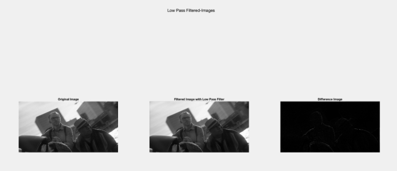

As seen from Figure 3 and GIF 1, the noise is reduced by a 5x5 box filter. The difference may not be so noticeable in Figure 3. Due to that fact, I took the difference between the original image and the filtered image. As seen from the difference image, the noise is reduced mostly on the edges of the image. The box filter is a low-pass filter and low-pass filters reduce the high frequency components in the image. The edges are having higher frequencies and the noise also increases the high frequencies more. Due to that fact, the low-pass filter blurred the edges of the image when compared to the original image. In GIF 1, the difference can be seen better. 


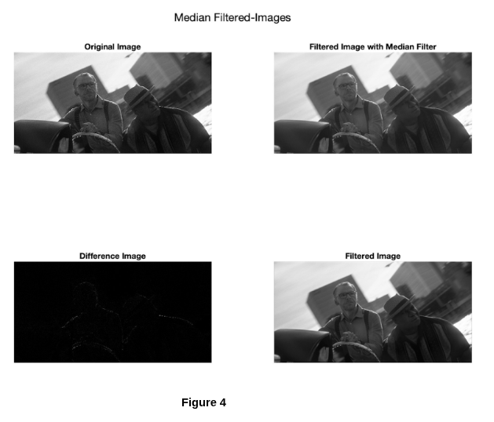

As seen from Figure 3 and GIF 2, the noise is reduced by a median filter. The difference may not be so noticeable in Figure 4. Due to that fact, I took the difference between the original image and the filtered image. As seen from the difference image, the noise is reduced mostly on the edges of the image similar to part a.  In GIF 2, the difference can be seen better.  Median filters preserve steps and ramps while eliminating the pulses. If we look at the white points of the suspender of the man without hat, we can see that they are nearly lost in median filtering while they are more visible in low-pass filtering. I think perceptually the image filtered in part a seems better since it preserves the brightness while in median filtering, the brightness changed a little.  However, in terms of the evaluation metrics, median filtering performed better than the box filtering. Here are the results with three evaluation metrics PSNR, MSE and SSIM. 


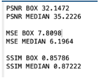

Figure 5 shows the results of the evaluation metrics. PSNR gives the ratio of maximum value of the pixel to the noise [1]. The high PSNR value shows a better reconstructed image [2]. As seen from Figure 5, the median filtered image has higher PSNR value. However, PSNR metric can be not very useful for information for reconstruction images every time. Therefore, I also look at the Mean Square Error and the Structure Similarity Metrics too. As seen for both of the metrics, median filtering shows better performance compared to the median filtering. 

When we look at the flat areas of both filtering results, we can see that they perform similarly in that area. However, both work better in high-contrast edges and areas of fine details. One can see the resulting images and the flicker animated videos in the folder “Q1_Resulting_Images” i submitted. 


---

### 2. Filtering on Gaussian vs Salt-and-Pepper Noise
Tested filters on `Edges_gnoise.tif` and `Edges_spnoise.tif`:  
- **Gaussian noise**: Wiener filter performed best (close to theory), followed by 3×3 averaging.  
- **Salt-and-pepper noise**: 3×3 median filter performed best.  
- **9×9 averaging filter**: reduced noise but excessively blurred edges.  
- **Wiener2**: minimized MSE by adaptively handling both degradation and noise.  

**Code**:
```
clear; clc; close all;
%Read gaussian noise image
edges_gnoise = imread("Edges_gnoise.tif");
%Read salt an pepper noise image
edges_spnoise = imread("Edges_spnoise.tif");

%Use the function you defined to remove the noise from images by usin
%averaging, median and wiener filtering for both gaussian and salt and
%pepper noisy images
remove_noise_from_img(edges_gnoise, 'Gaussian Noise')
remove_noise_from_img(edges_spnoise, 'Salt and Pepper Noise')


%% This function will take image and image name as input
% It will displayed the image filtered by using averaging, median and wiener
function remove_noise_from_img(image, img_name)
    %Create Averaging Kernel
    averaging_kernel_3 = createAveragingKernel(3);
    averaging_kernel_9 = createAveragingKernel(9);
    
    %Apply averaging kernels
    averaging_img_3 = imfilter(image, averaging_kernel_3);
    averaging_img_9 = imfilter(image, averaging_kernel_9);
    
    %Median Filtering with 3x3 kernel
    %Since medfilt2 function does not take 3 dimensional images, we will loop
    %for each dimension and filter like that
    for c = 1 : 3
        median_img(:, :, c) = medfilt2(image(:, :, c), [3, 3]);
    end

    %Wiener Filtering Image
    %Since wiener2 function does not take 3 dimensional images, we will loop
    %for each dimension and filter like that
    for c = 1 : 3
          %According to MATLAB documentation, if we are not giving
          %estimated noise, wiener2 will use the mean of the local variance
          %of the pixels. I wanted the check that value first
         [wiener_img(:, :, c),noise_out] = wiener2(image(:, :, c), [3, 3]);
         disp("Estimated Noise By Wiener 2 Function" +noise_out);
         %I gave noise estimation 5 times of that estimation to
         %understand its effect
         wiener_img2(:, :, c) = wiener2(image(:, :, c), [3, 3],noise_out*5);
         wiener_img3(:, :, c) = wiener2(image(:, :, c), [5, 5],noise_out*5);
    end

    %Display the Images 
    images = {image, averaging_img_3, averaging_img_9, median_img, wiener_img, wiener_img2, wiener_img3};
    labels = {'Q2-Original Image', 'Q2-Averaging Filtering with 3x3 Kernel', 'Q2-Averaging Filtering with 9x9 Kernel', 'Q2-Median Filtering with 3x3', "Q2-Wiener Filtering with 3x3, Estimate " + noise_out, "Q2-Wiener Filtering with 3x3, Estimate " + noise_out * 5,"Q2-Wiener Filtering with 9x9, Estimate " };
    figure;
    for i=1:length(images)
        currentImage = images{i};
        % Create a subplot
        subplot(3, 3, i);
        % Display the image with its label
        imshow(currentImage, []);
        title(labels{i} + " " + img_name);
        imwrite(mat2gray(currentImage),fullfile("Q2_Resulting_Images", labels{i}+".jpg"));
    end
    % Adjust layout
    sgtitle("Q2-" + img_name + " Images with Labels");
    set(gcf, 'Position', [100, 100, 800, 600]);
    saveas(gcf, fullfile("Q2_Resulting_Images", img_name + " Images with Labels.jpg"));
end

%% This function will take kernel size and create averaging kernel
function averaging_kernel = createAveragingKernel(kernel_size)
    averaging_kernel = ones(kernel_size,kernel_size) * (1/(kernel_size^2));
end
```
For this question I created two different functions in MATLAB. One of them createAveragingKernel  is taking kernel size as the input and return the averaging kernel. The other function  remove_noise_from_img  is taking both the image itself and the image name. It is displaying the averaging, median and wiener filtered images. Since the medfilt2  and  wiener2  do not accept 3 dimensional arrays, I had to loop over each dimension during filtering. When I use the wiener2 function, first I want to check the noise value which the wiener2  function returns first. According to the MATLAB documentation, it returned the mean of the local variance [3]. In order to understand the effect of the noise estimation argument, I gave noise estimation as five times bigger than the estimated one by the wiener2  function. What I got from this code can be seen in Figure 6 and Figure 7.  The resulting images can be found in the folder named “Q2_Resulting_Images” I submitted.


**Results**:

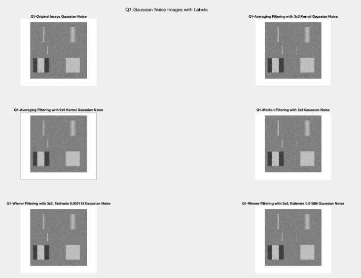

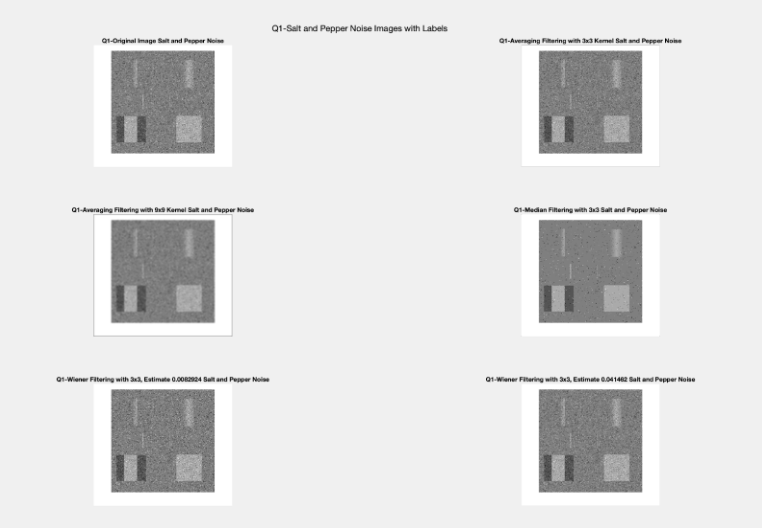


---

### 3. Gaussian Noise Simulation & Variance Theory
- Created Gaussian noise (σ=30) on flat background (value=50).  
- Applied **5×5 averaging filter**: std. reduced from ~30 → 6.31 (theory: 6.00, error ~5%).  
- Applied filter again: std. dropped to 4.91 (theory: 1.26, deviation explained by averaging stabilization).  
- **Median filtering**: reduced std. to 7.94, but preserved edges better.  
- **Conclusion**: Averaging filter is superior for Gaussian noise suppression, but with more blurring.  

**Code**:
```
clear; clc; close all;
%Create a 2D image which have a flat background of 50
img = ones(500,500) * 50
%image containing Gaussian noise with a standard deviation of 30 gray-scale values
% Generate Gaussian noise
noise = 30 * randn(500);
% Add noise to the background
noise_img = img + noise;

%% Part a- Filter the image using a 5x5 averaging filter. Show the images before and after. 
% Compute the noise standard deviation and mean before and after filtering. Create a histogram
% in MATLAB for both images and compare them. Compare your standard deviation result to the theoretical
% estimate of Gaussian white noise variance after average filtering with a 5x5 kernel, using information
% given in the lecture.

%Lets filter the image using a 5x5 averaging filter
averaging_kernel_5 = createAveragingKernel(5)
%Apply averaging kernels
averaging_img_5 = imfilter(noise_img, averaging_kernel_5);
%Show the images before and after
images = {noise_img, averaging_img_5}
labels = {'Image with Gaussian Noise','Image Filtered by 5x5 Averaging Kernel' }

%Look this function for Part A
showImages(images,labels, 'Q3_Resulting_Images', 'Averaging by 5x5 -Part a',1,2)

%% Part b- Take the output image from (a) and filter it again with the 5x5 averaging filter. 
% What is the standard deviation? Compare the result to the theory from (a). 
% Give a rationale for any deviation from the simple theory.
averaging_img_5_b =  imfilter(averaging_img_5,averaging_kernel_5);
images{end+1} = averaging_img_5_b
labels{end+1} = 'Image Filtered by 5x5 Averaging Kernel Twice'
showImages(images,labels, 'Q3_Resulting_Images', 'Averaging by 5x5 -Part b',1,3)

%% Part c- Filter the original image with a 5x5 median. Show the result images before and after.
% Compute the standard deviation of the noise before and after filtering.
median_img = medfilt2(noise_img, [5, 5]);
images{end+1} = median_img
labels{end+1} = 'Image Filtered by 5x5 Median'
% Part c & d
showImages(images,labels, 'Q3_Resulting_Images', 'Averaging by 5x5 -Part c and d',2,2)

%% This function will display the images and their histograms
function showImages(images, labels, file_name, final_image_name, subplot_x,subplot_y)
%Display the Images 
    figure
    for i=1:length(images)
        currentImage = images{i};
        % Create a subplot
        subplot(subplot_x, subplot_y, i);
        % Display the image with its label
        imshow(currentImage, []);
        % Compute the noise standard deviation and mean before and after filtering. 
        title(labels{i} + " mean:" + mean2(currentImage) + " std: " + std2(currentImage));
        imwrite(mat2gray(currentImage),fullfile(file_name, labels{i}+".jpg"));
    end
    figure
    for i=1:length(images)
        currentImage = images{i};
        % Create a subplot
        subplot(subplot_x, subplot_y, i);
        % Create histogram for both images
        histogram(currentImage, 'Normalization','count');
        title(labels{i});
        imwrite(mat2gray(currentImage),fullfile(file_name, labels{i}+".jpg"));
    end
    % Adjust layout
    sgtitle(final_image_name);
    set(gcf, 'Position', [100, 100, 800, 600]);
    saveas(gcf, fullfile(file_name, final_image_name+ ".jpg"));
end


%% This function will take kernel size and create averaging kernel
function averaging_kernel = createAveragingKernel(kernel_size)
    averaging_kernel = ones(kernel_size,kernel_size) * (1/(kernel_size^2));
end
```

Codes can be seen in the code. For this question I created two different functions in MATLAB. One of them, createAveragingKernel  is taking kernel size as the input and returning the averaging kernel. The other function  showImages  is taking 6 different arguments to display the images in the intended way. It is taking the images and their labels as the input. Besides that, it is taking the file name for saving them in that file and the name of the image as the final_image_name. Besides that, subplot_x and subplot_y are the sizes of the plotting window to show multiple images in one window. In this function, both the histogram and the images are displayed. 


**Results**:

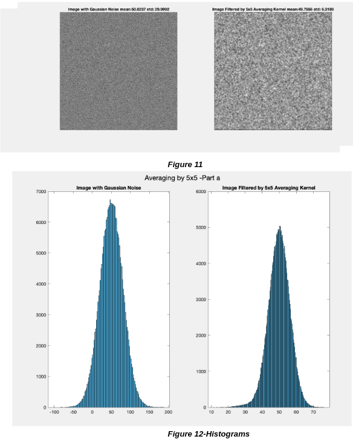


---

### 4. Morphological Opening vs Closing (`drink.png`)
- **Erosion with disk r=3** → shrank objects, thinned text, removed background shapes.  
- **Dilation of eroded image (opening)** → preserved text but removed narrow regions.  
- **Closing (dilation→erosion)** → filled narrow gaps, merged objects, preserved background.  
- **Key insight**: Opening removes narrow structures; Closing joins breaks and fills holes.  

**Code**:
```
clear; clc; close all;
%% Read Images
 drink_img = imread("drink.png");

 %% Part a- Use strel to create a structuring element d3, a disk of radius 3
 d3 = strel('disk',3);

 %% Part b- Apply d3 to erode the binary image in drink.png using imerode. Describe what happened
 % and why.
 eroded_img = imerode(drink_img,d3);
 images_b = {drink_img, eroded_img};
 labels_b = {"Original Image","Eroded Image"};
 showImages(images_b, labels_b, "Q4_Resulting_Images/b", "Eroded Image", 1,2)

 %% Part c- Apply d3 to dilate the result of part (b) using imdilate. Describe what happened and why.
% Note that the result is what you would have gotten by applying imopen to the original
% image with structuring element d3
dilated_after_eroded = imdilate(eroded_img,d3);
opened_img = imopen(drink_img,d3);
images_c = {drink_img, eroded_img, dilated_after_eroded, opened_img, opened_img-dilated_after_eroded};
labels_c = {"Original Image","Eroded Image", "Dilation of Erode Image","Open Image","Difference of Dilate+Erode and Open Image"};
showImages(images_c, labels_c, "Q4_Resulting_Images/c", "Open Image", 2,3)

%% Part d- Now suppose we were to reverse the order of erosion and dilation (i.e., morphological
% closing instead of morphological opening). Explain what you see, and discuss why the
% two results are different.
dilated_img = imdilate(drink_img,d3);
eroded_after_dilated = imerode(dilated_img,d3);
closed_img = imclose(drink_img,d3);
images_d = {drink_img, dilated_img, eroded_after_dilated, closed_img, closed_img-eroded_after_dilated};
labels_d = {"Original Image","Dilated Image", "Erode Dilated Image","Close Image","Difference of Erode+Dilate and Close Image"};
showImages(images_d, labels_d, "Q4_Resulting_Images/d", "Close Image", 2,3)

 %% This function will display the images 
function showImages(images, labels, file_name, final_image_name, subplot_x,subplot_y)
%Display the Images 
    figure
    for i=1:length(images)
        currentImage = images{i};
        % Create a subplot
        subplot(subplot_x, subplot_y, i);
        % Display the image with its label
        imshow(currentImage, []);
        % Compute the noise standard deviation and mean before and after filtering. 
        title(labels{i});
        imwrite(mat2gray(currentImage),fullfile(file_name, labels{i}+".jpg"));
    end
    % Adjust layout
    sgtitle(final_image_name + "-Images");
    set(gcf, 'Position', [100, 100, 800, 600]);
    saveas(gcf, fullfile(file_name, final_image_name+ ".jpg"));
end
```
I used the showImages function as I used in the other questions. As wanted, first I created the disk structured element with radius 3 by using the strel function. After that, I eroded the image with this structure element. For part c, I dilated the eroded image. To compare it with the opening operation, I also performed the opening function directly by using imopen. After that, I took the difference between the opening and dilation of the eroded image to see whether there is any difference (I am aware it is the same operation from the classes, just to prove myself). For part d, I reversed the order of the erosion and dilation operations and again compared it with the closing operation.


**Results**:

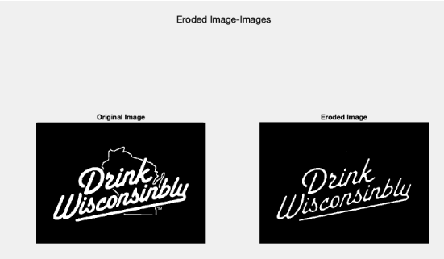

 Erosion operation shrinks the size of the objects and removes the small objects. As one can see, the background shape behind the text is removed when the image is eroded by using a 3 radius disk structure element. Besides that, the text becomes thinner since the erosion operation smooths the boundaries of it. To sum up, erosion shrinks all of the objects due its definition. If the structure element fits the part of the image when it is positioned (x,y), then the new value of the origin pixel will be 1, otherwise it will be 0. It shrinks the image since it uses fit situations between the image parts and the structure element instead of hit situations. 


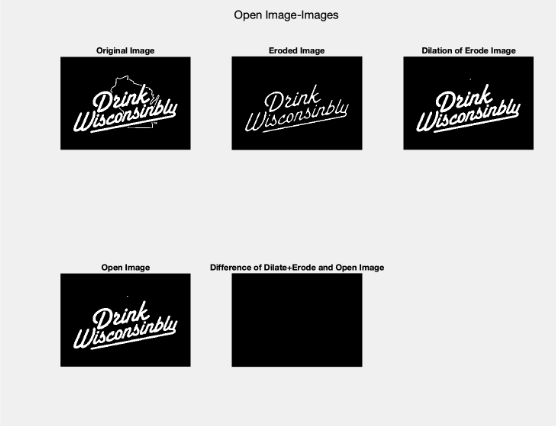

I first applied the erosion to the image (upper middle image). It is the same as in part a. After that, I apply dilation to the eroded image. The resulting image of this operation can be seen in the upper left of Figure 19. When we compare it with the eroded image (upper middle image), we can see that dilation enlarges the object. We can even see a dot at the above of the text in the dilation of the eroded image, which is not so visible in the eroded image. However, when we compare the dilation of the eroded image with the original image, we can see that the opening operation removes the white narrow isthmus (white shape background of the text) without changing the size or thickness of the text. In short, it eliminates the region narrower than the structure element by nearly preserving the size of the thicker regions. It is happening due to the nature of the opening operation. Erosion first, as you can see, shrinks the objects. Some objects can be removed totally. After that, dilating the image cannot bring back the objects that are already removed by the erosion but it can enlarge shrunken objects. After that, I also performed the opening by using the imopen function of the matlab and comparing it with the erosion+dilation. As one can see, there is no difference between them. 


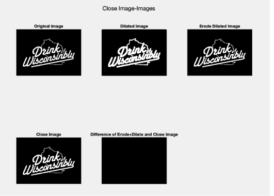

I first applied the dilation to the image (upper middle image).When we dilated the original image, we can see that the boundaries of the image and the size of the object are enlarged. After that, I apply erosion to the dilated image. The resulting image of this operation can be seen in the upper left of Figure 20.  When we compare it with the dilated image (upper middle image), we can see that erosion shrinks the object. However, when we compare the erosion of the dilated image with the original image, we can see that the closing operation tends to join narrow breaks and fill little holes. We can see the difference between them in Figure 21. As one can see, the “TM” text in the lower right corner of the text becomes one unit since the closing operation fills the blanks between them. They are close to each other. It is happening due to the nature of the closing operation. Dilation first, as you can see, enlarges the objects. Some objects can become one unit, not separated. After that, eroding the image cannot bring back the holes between those parts since the structure element fits anyway to the filled hole. After that, I also performed the closing by using the imclose function of the matlab and comparing it with the dilation+erosion. As one can see, there is no difference between them. And to note, both closing and opening smooth the contours of the images, even though it is kind of hard to notice them with a structure element with radius 3 (kind of small).


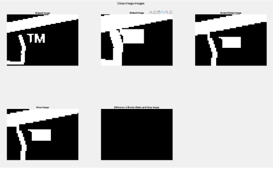

Two results are different from each other since the order matters for the morphological operations. As mentioned before, since the opening performed the erosion first, objects narrower from the structure element are removed and the dilation could not enlarge an object which is removed already. On the other hand, the closing operation performed the dilation first, so the objects removed in the opening operation will not be removed and enlarged more. Some holes will be filled and objects will be one unit instead of being separated objects. After that, the erosion will shrink to objects but cannot separate the holes and narrow breaks again, since they are already filled and it will be fit anyway due to that. This is the main difference between the processes. 


---

### 5. Morphological Noise Reduction (`cameraman.png`)
- **Dilation with disk r=3** → removed pepper noise but amplified salt noise.  
- **Opening + Closing sequence** → effectively removed both salt and pepper noise.  
- **Result**: Combined operations performed better than single-step dilation.  

**Code**:
```
clear; clc; close all;
% There are many uses of morphological operations. For example, it can be used to fill in small
% spurious holes (%pepper noise ) in images. In this problem, read the ‘cameraman.png’ image. This
% image contains pepper noise.
%% Read Images
 cameraman_img = imread("Cameraman.png");

 %% Part a- Use a suitable structuring element to dilate this image, hence removing the ‘pepper’ noise
% from the image. Show your final image.
 SE = strel('disk',3);
 dilated_img = imdilate(cameraman_img,SE);
 figure;
 imshow(dilated_img, []);
 title("Dilated Image");

%% Part b- There is also “salt” noise in the image. The best way to filter noise in a gray scale image
% with morphological operations is to use open and close operations. Design an open-close
% gray scale morphology operation to reduce both salt and pepper noise. Show your final
% image.
opened_img = imopen(cameraman_img,SE);
closed_img = imclose(cameraman_img,SE);
closed_after_opened = imclose(opened_img,SE);
opened_after_closed = imopen(closed_img,SE);
imshow(closed_after_opened, []);
title("Closed After Open");


%% Part c- Compare the images from (a) and (b).
images = {cameraman_img, dilated_img,opened_img, closed_img, closed_after_opened, opened_after_closed};
labels = {"Original Image","Dilated Image","Opened Image","Closed Image","Closed after Opened Image ssim: "+ssim(closed_after_opened,cameraman_img) + " psnr: " + psnr(closed_after_opened,cameraman_img),"Opened after Closed Image ssim: "+ssim(opened_after_closed,cameraman_img)+ " psnr: "+ psnr(opened_after_closed,cameraman_img)};
showImages(images, labels, "Q5_Resulting_Images", "Noise Reduction-Morphology", 3,2);

%% This function will display the images 
function showImages(images, labels, file_name, final_image_name, subplot_x,subplot_y)
%Display the Images 
    figure
    for i=1:length(images)
        currentImage = images{i};
        % Create a subplot
        subplot(subplot_x, subplot_y, i);
        % Display the image with its label
        imshow(currentImage, []);
        % Compute the noise standard deviation and mean before and after filtering. 
        title(labels{i});
        imwrite(mat2gray(currentImage),fullfile(file_name, labels{i}+".jpg"));
    end
    % Adjust layout
    sgtitle(final_image_name + "-Images");
    set(gcf, 'Position', [100, 100, 800, 600]);
    saveas(gcf, fullfile(file_name, final_image_name+ ".jpg"));
end
```
 I used the showImages function that I used in the other questions. Firstly, for part a, I created a disk structural element with radius 3 to remove the ‘pepper’ noise. I did not use a structure element that has a bigger radius since this makes the salt noise bigger. For both part b and c, I tried open and closed operations and their possible combinations to reduce both of the ‘salt’ and ‘pepper’ noises. The resulting images can be found in the folder named “Q5_Resulting_Images” I submitted.


**Results**:

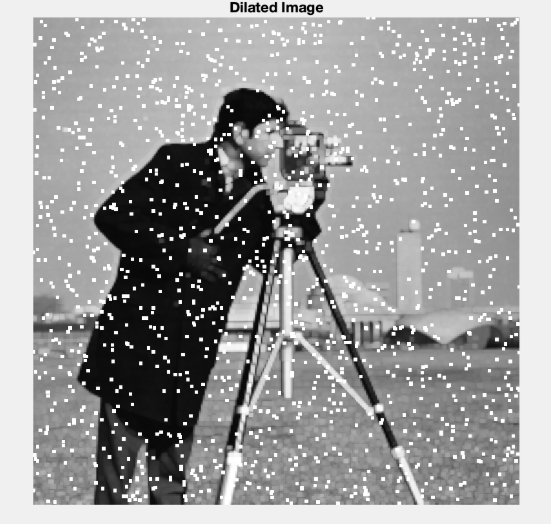

the disk structure element with radius 3 removes the pepper noise from the image. However, it also enhances the salt noise as one can see. Therefore, dilation is not enough to remove both noises from the image.


Even though the quality of the image is also reduced, the operations ( in order) opening and closing reduced nearly all of the both salt and pepper noise in the grayscale image as one can see in Figure.

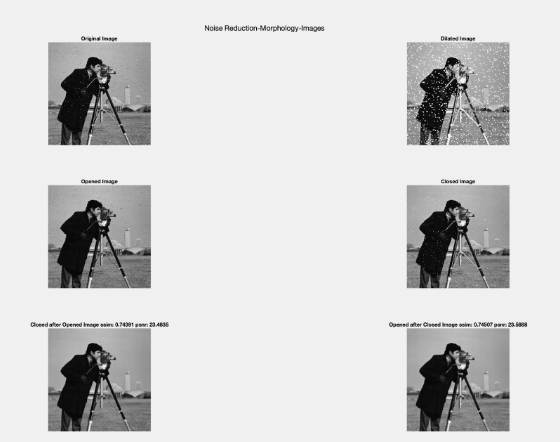

Other than the dilated image, I also applied the closing, opening operations and their combinations(closing first, opening later; or opening first and closing later) to see the effects and the difference between them. The opening after the closed image (right bottom corner image) is the same as the image resulted in part b. As one can see, the opening image is better when reducing the salt noise. On the other hand, the closing image is better when reducing the pepper noise. When we combine opening and the closing operations, we got the best result to reduce both salt and pepper noise. However, I found that first closing and then opening has a better performance in terms of ssim and psnr metrics. However, since we are asked to compare the image in part a and b, we can easily say that the combined opening and closing operations results better than only the dilation. 


---

### 6. Separating Touching Objects (`circles.png`)
- Thresholded → reversed binary values (coins black → white).  
- **Erosion** with structuring element → successfully separated touching coins.  
- Resulting image enables **object counting with labeling algorithms**.  

**Code**:
```
clear; clc; close all;
% Read the image
circle_img = imread('Circles.png');
circle_img_2d = im2gray(circle_img);

% Consider the image Circles.png.
% There are many special uses of erosion. One of the most common application using the erosion is
% to separate the touching objects in a binary image so that can be counted using a labeling
% algorithm. In this section just use the erosion method to display the circles in the image
% distinctly. The image shows a number of dark disks against a light background.
%% Part a- Do a thresholding of this image.
level = graythresh(circle_img_2d);
thresholded_img = imbinarize(circle_img_2d,level);
negative_thresholded_image = ~thresholded_img;
%% Part b-Then use the erosion operation to display the circles distinctly in the image.
SE = strel('disk',11);
eroded_img = imerode(negative_thresholded_image,SE);

%% Part c- Show your output from each step.
images = {circle_img, circle_img_2d, thresholded_img, negative_thresholded_image, eroded_img};
labels = {"Original Image", "2D conversion of Original Image","Thresholded Image","Negative Thresholded Image","Eroded Image"};
showImages(images, labels, "Q6_Resulting_Images", "Seperate Touching Objects", 2,3);

%% This function will display the images 
function showImages(images, labels, file_name, final_image_name, subplot_x,subplot_y)
%Display the Images 
    figure
    for i=1:length(images)
        currentImage = images{i};
        % Create a subplot
        subplot(subplot_x, subplot_y, i);
        % Display the image with its label
        imshow(currentImage, []);
        % Compute the noise standard deviation and mean before and after filtering. 
        title(labels{i});
        imwrite(mat2gray(currentImage),fullfile(file_name, labels{i}+".jpg"));
    end
    % Adjust layout
    sgtitle(final_image_name + "-Images");
    set(gcf, 'Position', [100, 100, 800, 600]);
    saveas(gcf, fullfile(file_name, final_image_name+ ".jpg"));
end
```
I used the showImages function that I used in the other questions. For part a, I first perform the thresholding by using the imbinarize function. However, in order to perform erosion to separate the touching objects, I had to reverse the pixel values of the binarized object. Imbinarize function of the original image makes the coins black while it makes the background white. If we try to erode the image in that way, we enlarge the black coins. However, we want to separate them. Because of that reason, I reverse the colors of the imbinarized image and apply erosion like that. 


**Results**:

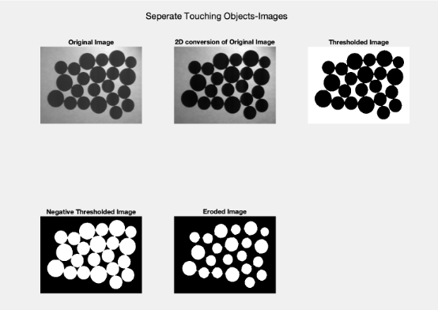

Figure shows each step of separating the touching objects in a binary image. Firstly, I performed 2D conversion of Original image in order to apply the imbinarize function of MATLAB. Because of this conversion, even though the image seems different (probably lost some information), since we are going to use the thresholded version of it, it does not make a big difference. However, this version of the thresholded image (upper right corner) has black coins and white background. If we perform erosion in order to seperate the touching coins between them, we cannot achieve our aim since the erosion will enlarge the black coins. Due to that fact, I reverse the black and whites of the binarized image and get the “Negative Thresholded Image” in the bottom left corner. After that, I erode the image using structurel element and got the result “Eroded Image”. Notice that this operation separates the touching objects successfully so that one can count using a labeling algorithm. 


---

### 7. Separating Circles vs Lines (`Circle_and_Lines.png`)
- Tested structuring elements (disk, diamond, square, sphere).  
- **Sphere structuring element, r=22** gave best separation of circles and lines.  
- Applied **opening** to isolate objects, then **labeling via `regionprops`** to count them.  
- **Limitations**: sensitive to structuring element choice, fails with overlapping objects.  

**Code**:
```
clear; clc; close all;
% Read the image
img = imread("Circle_and _Lines.png");
img = rgb2gray(img);
% In this section you will be separating out various objects from the images using the opening
% function. For the given image Circle_and_Lines.png, use the opening technique with the
% appropriate structuring element. Your mission is to separate the circles from the lines:
%% Part a-Determine the proper opening structuring element(s) to separate the image above into two
%separate images, one only showing circles, and one only showing lines. Print the final
%images and describe the structuring element(s) used. Ideally, you should only need one
%structuring element to isolate one of these, and then you can use a subtraction method.
types = ["diamond", "disk", "square", "cube", "sphere"];
images = {};
labels = {};
for j=1:length(types)
    r = 22;
    SE = strel(types(j),r);
    open_img = imopen(img,SE);
    images{2*j-1} = open_img;
    labels{2*j-1} = types(j);
    images{2*j} = img-open_img;
    labels{2*j} = types(j) + " Extracted Lines";
end
showImages(images,labels, "Q7_Resulting_Images/a", "open image",5,2)
%% Part b- What are the drawbacks or limitations of this method? Compare and contrast with the
% previous methods you have implemented in any of the prior problems.

%% Part c- Apply opening to the same image with the same structural element(s) of different sizes.
% How do the sizes of the structuring elements affect the results? (Show images with
% titles/labels).
types = {'diamond', 'disk', 'square', 'cube', 'sphere'};
sizes = [5, 10, 15, 20, 25];
for j = 1:length(types)
    images_c = {};
    labels_c = {};
    for k = 1:length(sizes)
        SE = strel(types{j}, sizes(k));
        open_img = imopen(img, SE);
        images_c{2*k-1} = open_img;
        labels_c{2*k-1} = strcat(types{j}, " Extracted Circles ", num2str(sizes(k)));
        images_c{2*k} = img - open_img;
        labels_c{2*k} = strcat(types{j}, " Extracted Lines ", num2str(sizes(k)));
    end
    showImages(images_c, labels_c, "Q7_Resulting_Images/c", strcat("open image ", types{j}), 5, 2);
end

%% Part d- Develop an algorithm: using the appropriate morphological filters, to count how many
% circles and how many lines are there in your outputted images from (a). Label each item
% in the picture with a distinct integer (suggestion: use MATLAB%s "text” command).
% Discuss your algorithm briefly. Report the algorithm for the code, counting results, and
% final images in the report. NOTE: there are several helpful built-in matlab commands for
% working with binary objects. if you use them, report what they are doing.
%%  For disks
SE = strel("disk", 22);
open_img = imopen(img, SE);
countAndLabel(open_img)

%% For lines
SE = strel("disk", 22);
open_img = imopen(img, SE);
SE2 = strel("disk", 4);
lines_img = img - open_img
lines_img = imopen(lines_img, SE2);
countAndLabel(lines_img)

function countAndLabel(open_img)
    se = strel('disk', 3); % Define the structuring element (disk shape with radius 3)
    image_dilated = imdilate(open_img, se); % Dilate the image
    image_eroded = imerode(open_img, se); % Erode the image
    
    % Get the contours by subtracting the eroded image from the dilated image
    contours = image_dilated - image_eroded;
    figure 
    imshow(contours, [])

    
    % Find connected components in the binary image
    cc = bwconncomp(contours);
    
    % Calculate properties of the connected components
    props = regionprops(cc, 'Centroid');
    
    % Plot the contours and mark the centroids with numbers
 
    hold on;
    for i = 1:length(props)
        centroid = props(i).Centroid;
        text(centroid(1), centroid(2), num2str(i), 'Color', 'red', 'FontSize', 12);
    end
    hold off;
end

%% This function will display the images 
function showImages(images, labels, file_name, final_image_name, subplot_x,subplot_y)
%Display the Images 
    figure
    for i=1:length(images)
        currentImage = images{i};
        % Create a subplot
        subplot(subplot_x, subplot_y, i);
        % Display the image with its label
        imshow(currentImage, []);
        % Compute the noise standard deviation and mean before and after filtering. 
        title(labels{i});
        imwrite(mat2gray(currentImage),fullfile(file_name, labels{i}+".jpg"));
    end
    % Adjust layout
    sgtitle(final_image_name + "-Images");
    set(gcf, 'Position', [100, 100, 800, 600]);
    saveas(gcf, fullfile(file_name, final_image_name+ ".jpg"));
end


```
 I used the showImages function that I used in the other questions. Besides that, I also defined another function called countAndLabel which first finds the contours of the circles which are separated by the opening function. After finding the contours, by using the regionprops function, I calculate the centroids of each contour. This function measures the centroids and some other additional properties such as area of each contour according to the MATLAB document [6]. After that, by using the text function of MATLAB, I showed the numbers on the objects [7]. For part a, I tried different styles of structural elements to find the best result such as diamond, disk, square and cube. For part c, I also tried different sizes of structural elements. The resulting images can be found in “Q7_Resulting_Images”.

 I used the showImages function that I used in the other questions. Besides that, I also defined another function called countAndLabel which first finds the contours of the circles which are separated by the opening function. After finding the contours, by using the regionprops function, I calculate the centroids of each contour. This function measures the centroids and some other additional properties such as area of each contour according to the MATLAB document [6]. After that, by using the text function of MATLAB, I showed the numbers on the objects [7]. For part a, I tried different styles of structural elements to find the best result such as diamond, disk, square and cube. For part c, I also tried different sizes of structural elements. The resulting images can be found in “Q7_Resulting_Images”.

**Results**:

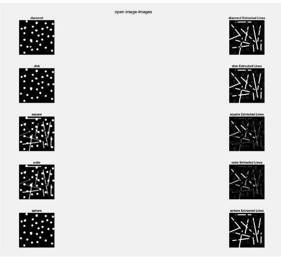

the shape of the morphological structure elements will affect the results. For example, the diamond structure element results in diamond shape circles etc. According to Figure 30, the best morphological structure element for the separation of circles and lines belongs to the sphere structure element. Disk also results good compared to the other ones.


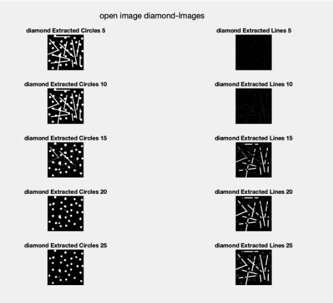

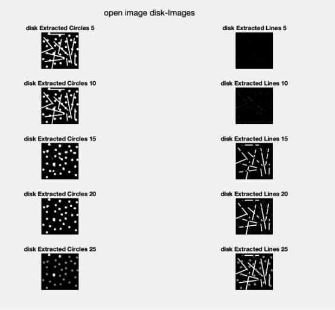

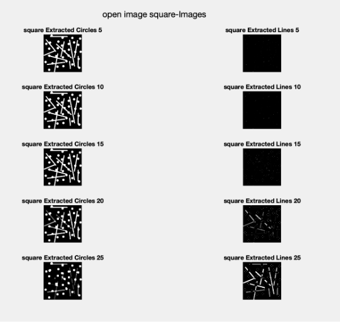

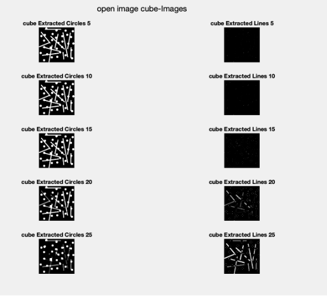

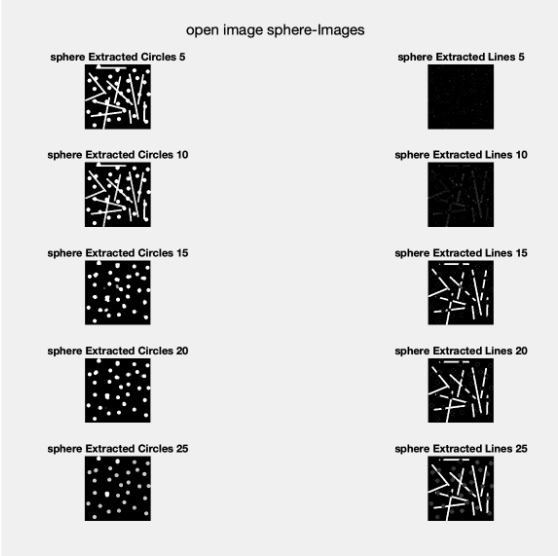

These figures shows opening operation with different types of kernel in different sizes. For all of these structure elements, if the radius is getting higher, the separation of the objects seems better. We can still see the different types of different structure elements also affect the separation and show their characteristics in the results. The best result according to me is the sphere extracted circles with radius 20. When the radius is 25, it can also be considered as good separation. However, we can notice that some circles also fade away in that situation. Separation with structure elements 5 and 10 mostly failed in all of the structure elements type. Therefore, we can say that either too big or too small structure elements can cause us to separate the object worse sometimes. 


---

### 8. Cleaning & Gradients (`finger_print.tif`, `text.tif`, `city.tif`)
- **Fingerprint**: opening + closing cleaned ridge noise.  
- **Text**: smaller radius opening + closing removed artifacts while preserving text.  
- **City**: morphological gradient (dilate–erode) highlighted edges and contours.  

**Code**:
```
clear; clc; close all;
% Read the image
finger_print_img = imread("finger_print.tif");
text_img = imread("text.tif");
city_img = imread("city.tif");

%% Part a- Using the finger_print.tif image, apply any combination of the morphological operations
% to clean the image
SE= strel('disk',3)
opened_img = imopen(finger_print_img,SE)
closing_opened_img = imclose(opened_img, SE)
images_a = {finger_print_img, opened_img, closing_opened_img};
labels_a = {"Original Image", "Opened Image", "Closing of Openning Image"};
showImages(images_a, labels_a, "Q9_Resulting_Images/a","Finger Print", 1, 3);

%% Part b- Using the text.tif image, apply any combination of the morphological operations to clean
% the image
% Perform morphological closing to fill holes
SE= strel('disk',1)
opened_img = imopen(text_img,SE)
SE2= strel('disk',3)
closing_opened_img = imclose(opened_img, SE2)
images_b = {text_img, opened_img, closing_opened_img};
labels_b = {"Original Image", "Opened Image", "Closing of Openning Image"};
showImages(images_b, labels_b, "Q9_Resulting_Images/b","Text Image", 1, 3);

%% Part c- Using the city.tif image, apply morphological gradient and display the resulting image.
SE= strel('disk',3);
dilated_img = imdilate(city_img,SE);
eroded_img = imerode(city_img,SE);
gradient = dilated_img - eroded_img;
images_c = {city_img, dilated_img, eroded_img, gradient};
labels_c = {"Original Image", "Dilated Image", "Eroded Image", "Gradient"};
showImages(images_c, labels_c, "Q9_Resulting_Images/c","City Image", 2, 2);


%% This function will display the images 
function showImages(images, labels, file_name, final_image_name, subplot_x,subplot_y)
%Display the Images 
    figure
    for i=1:length(images)
        currentImage = images{i};
        % Create a subplot
        subplot(subplot_x, subplot_y, i);
        % Display the image with its label
        imshow(currentImage, []);
        % Compute the noise standard deviation and mean before and after filtering. 
        title(labels{i});
        imwrite(mat2gray(currentImage),fullfile(file_name, labels{i}+".jpg"));
    end
    % Adjust layout
    sgtitle(final_image_name + "-Images");
    set(gcf, 'Position', [100, 100, 800, 600]);
    saveas(gcf, fullfile(file_name, final_image_name+ ".jpg"));
end
```

For part a, I used a disk structured element with radius 3 in order to clean the fingerprint image. I first applied the opening and then the closing to the opened image. For part b, I used a disk structured element with radius 1 to open the image. After that, I applied  the closing with structure element 3. I arrange these structured elements manually, according to my perception. For part c, I calculate the morphological gradient of the image by taking the difference between the dilated and the eroded version of the image with a disk structure element that has radius 3. As in the previous questions, I used the showImages function in order to display the images. One can find the images in the folder ‘Q9_Resulting_Images’ I submitted with this file.  


**Results**:

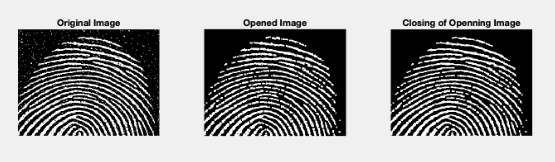

As one can see, the fingerprint image is cleaned very well by using opening and closing operations in order.

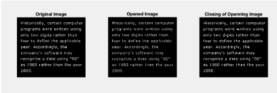

I used the same operations with part a, but I used different structure elements this time. I think it seems cleaned.

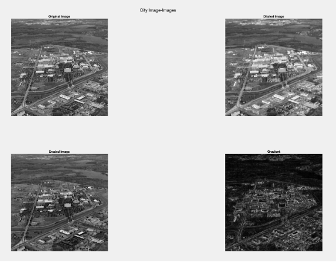

By taking the difference between dilation and erosion of the image, I got the morphological gradient of the image (lower left). As seen from the image, each pixel value in the image shows the contrast intensity in the close neighborhood pixels. 


---

## 🎓 Learning Outcomes
- Practical comparison of **spatial filters** for noise reduction (box, median, Wiener).  
- Theoretical vs experimental validation of **Gaussian variance reduction**.  
- Mastery of **morphological opening, closing, erosion, dilation, gradients**.  
- Object separation and labeling using MATLAB’s **regionprops**.  
- Demonstrated strengths and limitations of morphological methods.  

---

## 🛠️ Tools
- MATLAB (R2023a)  
- Image Processing Toolbox  

---

## 📜 References
- Gonzalez & Woods, *Digital Image Processing* (4th Edition).  
- MathWorks Documentation: `wiener2`, `medfilt2`, `regionprops`, `text`.  
- [Wiener Filter in Image Denoising](https://ijsea.com/archive/volume7/issue9/IJSEA07091014.pdf).  
- [PSNR/MSE/SSIM – Image Quality Metrics](https://www.mathworks.com/help/vision/ref/psnr.html).  

---

## 👩‍💻 Author
**Ilke Kas**  
Graduate Researcher – Robotics & Computer Vision  
[LinkedIn](https://www.linkedin.com/) | [GitHub](https://github.com/ilkekas)
